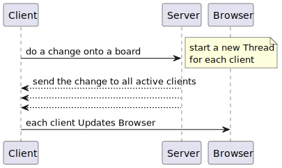

# Threads

## Client

**The Client has 3 major Threads:**

- 1 to process the UI
- 1 to be listening for incoming updates
- 1 to be sending outgoing updates to the browser

## Server

**The Server has 2 major Threads:**

- 1 to Accept incoming connections
- 1 to Handle each of the requests(codes) sent by the Client

## SD - Sequence Diagram

In order to process each change onto a board, the following diagram explains what happens between the applications.

**Here is the complement content to follow the Diagram:**

- The Client does a change on the board and sends it to the Server.
- The Server receives the request (with the thread to accept the requests), and each request triggers a thread
  to send the updates to the list of connected users (mapped by a token). (Using Observer Pattern)
- The Client receives the change and acts as a server to send those updates to the browser in order to be displayed.

# Synchronization problems

As there can be multiple users connected to the same board, there is a need to guarantee that the changes made by one
user are reflected on the other users' boards; moreover, multiple users should not be able to change the same cell at
the same time.

Thus, the following **synchronization problems** were identified:

1. Two users cannot create a post-it on the same cell at the same time.
2. Two users cannot delete a post-it at the same time.
3. A user cannot move a post-it to a cell while another user is creating a post-it on that same cell.

## Used Synchronization Mechanisms

In general, the synchronization mechanisms used were the ones provided by the Java language, namely:
- `synchronized` keyword for methods and on objects that provide a lock, such as `this` or `this.cells` where,
"this" can refer to boards or even individual cells.
- Nested `synchronized` blocks were used to ensure that the moving of a post-it is atomic, i.e., the post-it is
removed from the origin cell and added to the destination cell with nothing happening in between, in the respective
cells.
- Synchronized Collections, such as `Collections.synchronizedMap()` and `ConcurrentLinkedDeque` to ensure that 
access to boards and a cell's history is thread-safe.