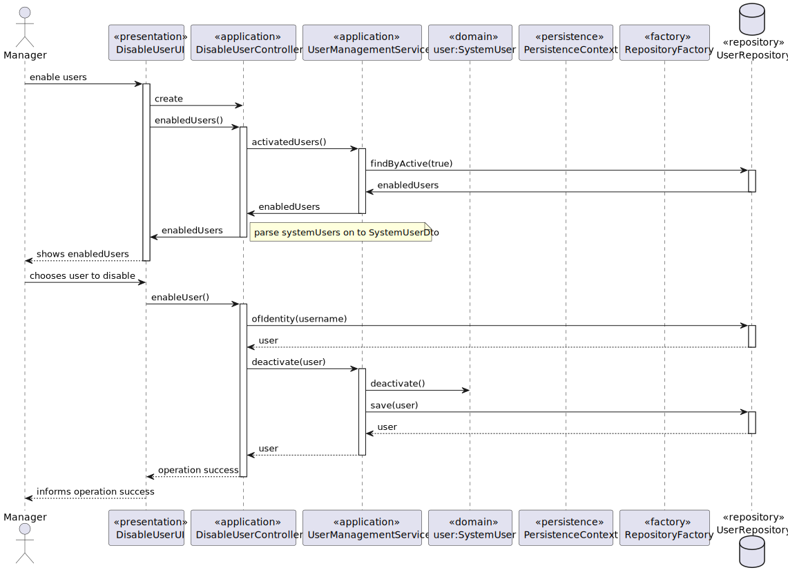
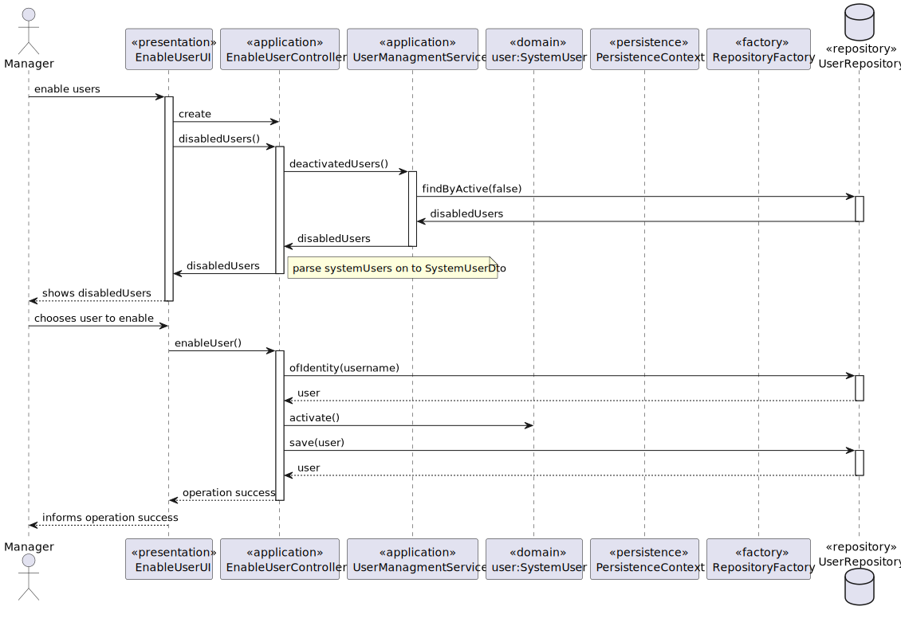

US 1001 -- Add/Register System User
==============================

# Analysis

## Business rules

- A user can have 2 states:
- enable : can use his credentials to log in the system
- disable : can't use his own credentials to log in the system

## Unit tests

- Implemented by the framework and for that reason, no tests where developed

## Classes

- Domain:
    + **UserManagementService**
    + **SystemUser**
- Application:
    + **AddUserController**
    + **UserManagementService**
    + **SystemUserBuilder**
- DTO 
    + **SystemUserNameEmailDto**
- Repository:
    + **UserRepository**

## Sequence Diagram 

### DISABLE

### ENABLE

