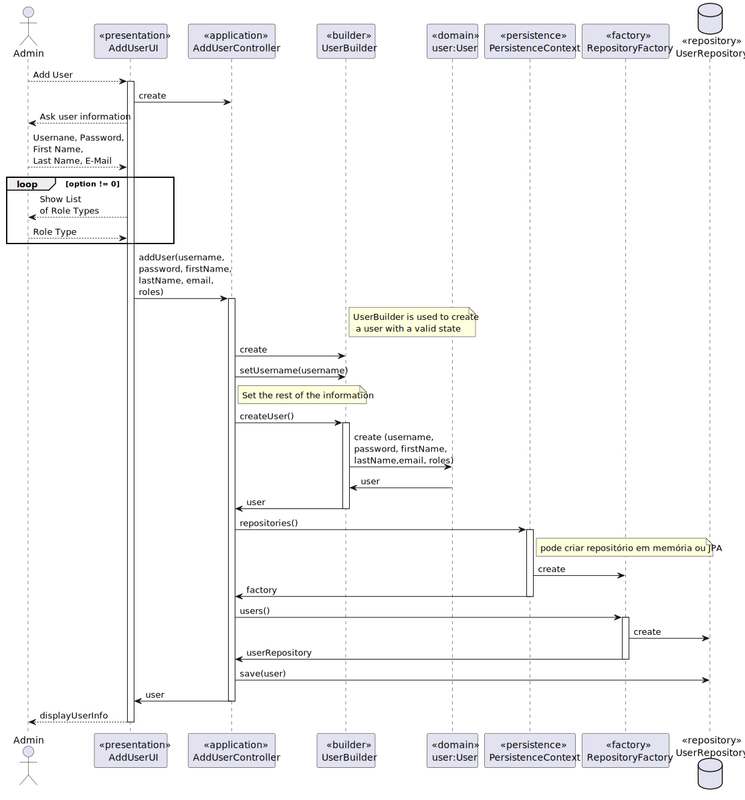

US 1001 -- Add/Register System User
==============================

# Analysis

## Business rules

- The username is Unique.

## Unit tests

- Implemented by the framework and for that reason, no tests where developed

# Design

- A system user must have a different username in different applications.

## Classes

- Domain:
    + **UserManagementService**
    + **SystemUser**
- Application:
    + **AddUserController**
    + **UserManagementService**
    + **SystemUserBuilder**
- Repository:
    + **ClientUserRepository**

## Sequence Diagram

