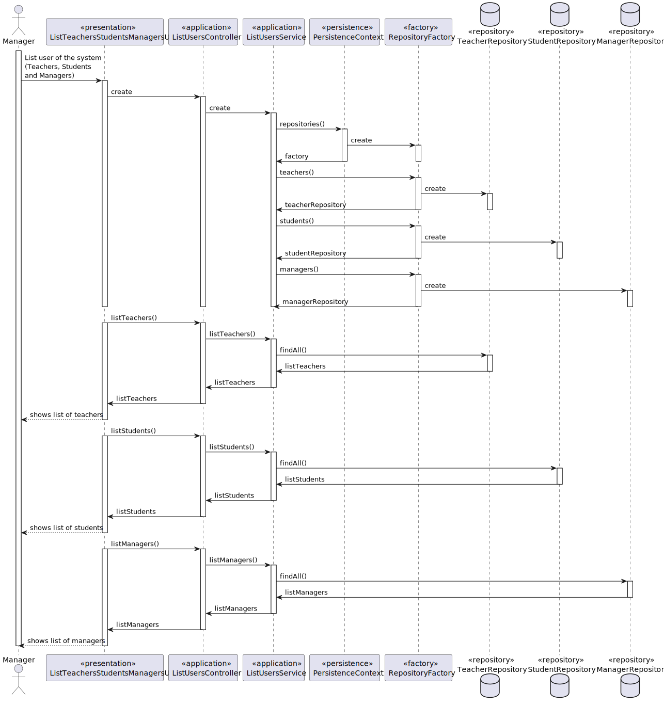

US 1001 -- List users of the system (Teachers and Students, as well as Managers)
==============================

# Analysis

## Business rules

- No business rules for this part of the US_1001. The only asked on this US is the printing of lists representing
 certain actors of the system.(Teachers,Students and Managers)

## Unit tests

- Implemented by the framework and for that reason, no tests where developed

# Design

- Three different lists were needed, each one representing respectively teachers, students and managers, for
  this porpouse we need to access the repository of Teacher, Student and Manager to get this list and presented 
  them to the user of the system that in this case is the Manager.

## Classes

- UI:
    + **ListTeachersStudentsManagersUI**
- Application:
    + **ListUsersController**
    + **ListUsersService**
- Repository:
    + **TeacherRepository**
    + **StudentRepository**
    + **ManagerRepository**

## Sequence Diagram

