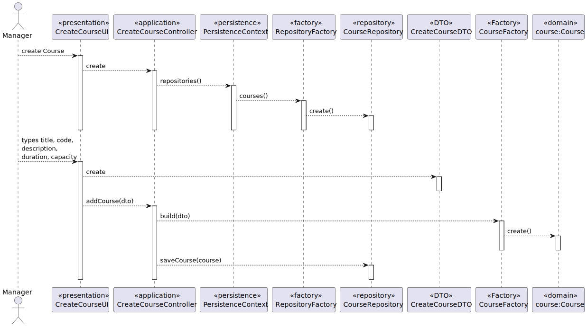

US 4001 -- Create Course
========================================================

# Requirements
- Create courses
- Consider different editions as being different courses
- Only managers execute this functionality

# Analysis

## Business rules

- Course is created in **close** state

- The manager provides the minimal requirements to create a course:
    + title & code (unique)
    + description
    + start & end date
    + capacity (minimum & maximum)

- The start and end date date
    + start date before end date
    + neither are related to the past

- Course capacity:
    + minimum capacity must be lower than maximum

# Design

## Patterns
- RepositoryPattern : in order to persist the courses created:
  - CourseRepositoryFactory
    - JpaCourseRepositoryFactory (persist in database)
    - InMemoryRepositoryFactory (persist in memory)

- DTO: provide inputs from the UI as a *package*; controller has no knowledge of
the DTO's contents.

- Factory: Create a Course from the DTO
## Classes
- Domain:
    + **Course**
        * **CourseID**
        * **CourseDescription**
        * **CourseState**
        * **CourseDuration**
        * **CourseCapacity**
    + **CourseFactory**

- Repository:
    + **CourseRepository**

- Controller:
    + **CreateCourseController**

- DTO:
    + **CreateCourseDTO**

## Unit tests - PLANNING

**Note:** Business rules and tests for **CourseState** are out of scope for this US,
and will be implemented in US 1003 and US 1004
### Course duration
+ ensureNotAllowWrongDateInterval
+ ensureNotAllowDatesFromPast
+ ensureNotAllowWrongCapacities

### Course Title
- ensureTitleCannotBeNull
- ensureCodeCannotBeNegative
- ensureIDMatchesPattern

### Course Capacity
- ensureCapacityMustBePositive
- ensureMaximumIsGreaterThanOrEqualToMinimum

## Sequence diagram

