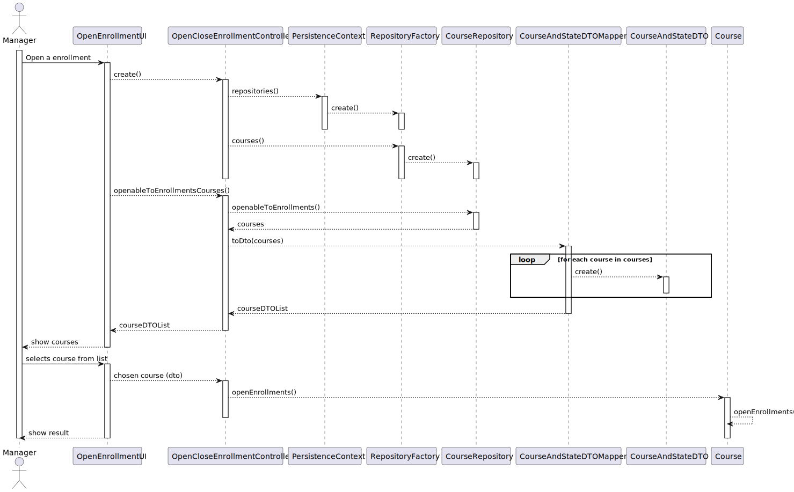
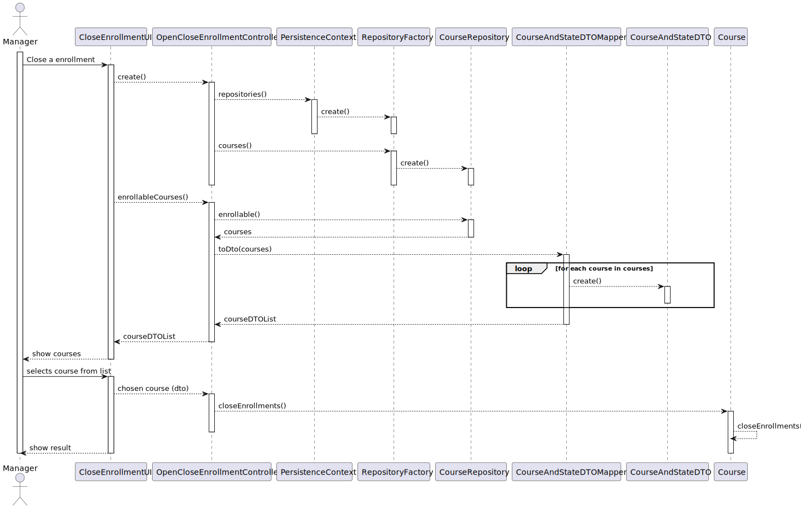

US 1003 -- Open/Close enrollments
==============================

# Analysis

## Business rules

- Any course enrollments can be in state "ENROLL" or "OPEN".
- When a course is in state "ENROLL", meaning that the enrollments for that course are open.
- When a course is in state "INPROGESS", meaning that the enrollments for that course are close.

## Unit tests

1. ensureOpenToEnrollmentsCourseCanBeClosed
2. ensureClosedToEnrollmentsCourseCanBeClosed

# Design

Even though this is a single use case, the user interface will be split into two:

1. Open a course --- **OpenEnrollmentUI**
2. Close a course --- **CloseEnrollmentUI**

The **DTO** pattern will be applied in order to decrease the coupling between the UI and
the domain classes.

Both UIs will require the manager to select a course from the existing ones, only courses that are available to 
be open to enrollments will be displayed when using **OpenEnrollmentUI**,will display courses that
can actually be enrollable. 
In the second case when using **CloseEnrollmentUI**, only courses
that are in the state **Enroll** will be shown to the **Manager** soo he can close the enrollments and after that the
course will be in the state **INPROGRESS**.(c.f. Business rules)

To avoid code duplication, the **strategy pattern** will be applied in the **CourseRepository**,
by creating a `ofStates(states)` that will provide a list of courses whose `state` matches any
in `states`. This makes this service very flexible as it can be repurposed for any other use
case that requires a list of courses with certain states.

For ease of use, the service will provide `enrollable()` and `openableToEnrollments()` methods, that internally
call `ofState()`.

## Classes

- Domain:
    + **Course**
    + **CourseState**
- UI:
    + **OpenEnrollmentUI**
    + **CloseEnrollmentUI**
- Controller:
    + **OpenCloseEnrollmentController**
- Repository:
    + **CourseRepository**
- DTO:
    + **CourseAndStateDTO**
    + **CourseAndStateDTOMapper**

## Sequence Diagram

