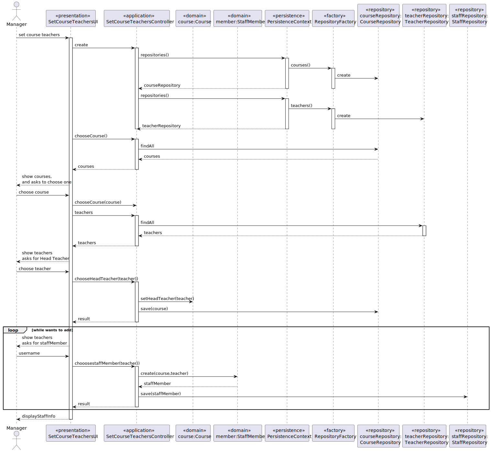

US1005 - Set Course Teachers
========================================================

# Requirements
Choose course to:
- Set head teacher
- Set staff members

# Analysis
## Business rules

- HeadTeacher can't be a staff member
- There must be no duplicated teachers in the staff 

## Classes
- Domain:
  + **Course**
  + **StaffMember**
  + **Teacher**
- Controller:
  + **SetCourseTeacherController**
- Repository:
  + **TeacherRepository**
  + **StaffRepository**
  + **CourseRepository**

##  Unit tests - PLANNING

- `ensureNoDuplicateTeachers()` --- there are no duplicated members in the staff
- `ensureHeadTeacherIsNotStaffMember()` --- head teacher can't be parte of staff
- `ensureStaffMembersAdded` --- teachers choosed are staffMembers

## Sequence diagram

