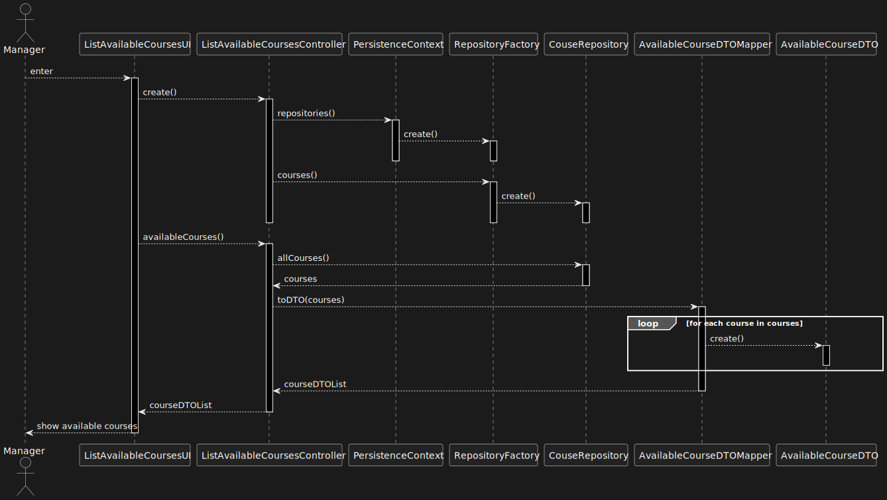

US 1006 -- List all the courses that are available to me
========================================================

# Analysis
## Business rules
This functionality is to be available to all 3 types of system users
(Teacher, Student, and Manager); however, the specific behavior of the US depends on
which type of user is trying to execute it:

- **Manager:**
    + *All* courses are to be displayed.
- **Teacher:**
    + All courses that this user *teaches*.
- **Student:**
    + All courses in which the student is *enrolled* or *may be enrolled*.

This is in accordance with [this forum post.](https://moodle.isep.ipp.pt/mod/forum/discuss.php?d=22495#p28467)
## Unit tests

In order to accurately test this functionality, we need to interact
with the Aggregate Root repositories, meaning unit tests aren't the best approach here.

Instead, integration tests should be performed.

# Design

The user interface will be split into 3: one for each user type.

The **ListCoursesService** will have the following method added to it:

1. `studentIsEnrolledOrCanEnroll(Student s)` --- courses a given student is enrolled in or can enroll

This method, at the repository level, will be broken down into two:

1. `enrollable()` --- courses the student can enroll in
2. `coursesOfEnrolledStudent` --- courses a given student is enrolled in

The **StaffMemberRepository** will have a `taughtBy` method to compute the courses that a given teacher
is a member of; i.e they're a teacher for that course.

3. `allCourses()` --- self-explanatory

The **DTO pattern** will be used to display the courses in the UI.

## Classes
- Domain:
    + **Course**
        * **CourseState**
    + **Student**
    + **Enrollment**
    + **Teacher**
    + **StaffMember**
- Controller:
    + **ListAvailableCoursesController**
    + **ListCoursesService**
- Repository:
    + **CourseRepository**

    + **EnrollmentRepository**
    + **StudentRepository**

    + **StaffRepository**
    + **TeacherRepository**

- DTO:
    + **AvailableCourseDTO**
    + **AvailableCourseDTOMapper**

## Sequence diagram

Student:

Teacher:

Manager:

