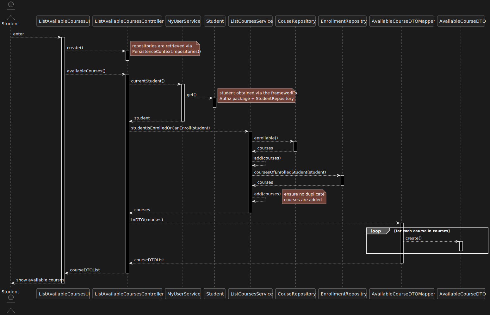
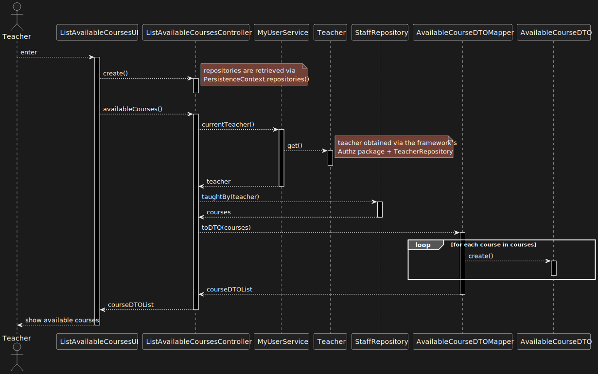

US 1006 -- List all the courses that are available to me
========================================================

# Analysis
## Business rules
This functionality is to be available to all 3 types of system users
(Teacher, Student, and Manager); however, the specific behavior of the US depends on
which type of user is trying to execute it:

- **Manager:**
    + *All* courses are to be displayed.
- **Teacher:**
    + All courses that this user *teaches*.
- **Student:**
    + All courses in which the student is *enrolled* or *may be enrolled*.

This is in accordance with [this forum post.](https://moodle.isep.ipp.pt/mod/forum/discuss.php?d=22495#p28467)
## Unit tests

In order to accurately test this functionality, we need to interact
with the Aggregate Root repositories, meaning unit tests aren't the best approach here.

Instead, integration tests should be performed.

# Design

The user interface will be split into 3: one for each user type.

The **ListCoursesService** will have some more methods added to it:

1. `taughtBy(Teacher t)` --- courses taught by a given teacher
2. `studentIsEnrolledOrCanEnroll(Student s)` --- courses a given student is enrolled in or can enroll
3. `allCourses()` --- self-explanatory

**Note:** the method to obtain a list of all courses is already implemented; so
there is no need to create a new one.
The `enrollable` simply be a convenient alias to the *strategy pattern* `ofState()` method already implemented.

The **DTO pattern** will be used to display the courses in the UI.

## Classes
- Domain:
    + **Course**
        * **CourseState**
    + **Student**
    + **Enrollment**
    + **Teacher**
    + **Staff** <!--TODO: name not final? -->
- Controller:
    + **ListAvailableCoursesController**
    + **ListCoursesService**
- Repository:
    + **CourseRepository**
    + **StudentRepository**
    + **TeacherRepository**

    <!-- + **EnrollmentRepository** -->
    <!-- + **StaffRepository** -->
- DTO:
    + **AvailableCourseDTO**
    + **AvailableCourseDTOMapper**

## Sequence diagram

Student:

Teacher:

Manager:

