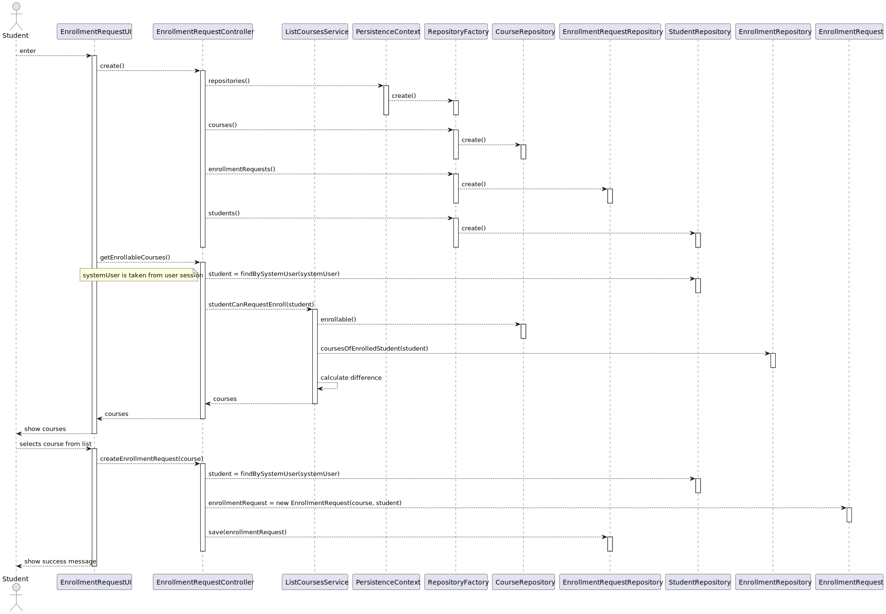

US 1008 -- Request my enrollment in a course
==============================

# Analysis

## Business rules

A student can request enrollment in a course if:
- The course is open to enrollments
- The student is not already enrolled in the course

## Unit tests

1. ensureCourseIsOpenToEnrollments
2. ensureStudentIsNotAlreadyEnrolled
3. ensureStudentCanRequestEnrollment

# Design

The system consists of two primary components, namely the **EnrollmentRequestUI** and the **EnrollmentRequestController**.
The former is responsible for receiving user input and displaying relevant information to the user, while the latter is
responsible for implementing the system's business logic and interacting with the domain classes.

In order to ensure a user-friendly experience, the **EnrollmentRequestUI** provides a list of courses that are available
for enrollment, thereby enabling the user to select the course of their choice.

To ensure the student can only select the appropriate courses (c.f business rules), a `studentCanEnroll` method will be
implemented in the **ListCoursesService**, which will obtain the set of courses *open to enrollments* and the set of
courses the student is *already enrolled in*, and then computes the difference between them.

## Classes

- Domain:
    + **Course**
    + **CourseState**
    + **EnrollmentRequest**
    + **EnrollmentRequestState**
    + **DeniedReason**
- Controller:
    + **EnrollmentRequestController**
    + **ListCoursesService**
- Repository:
    + **CourseRepository**
    + **EnrollmentRequestRepository**

## Sequence Diagram

