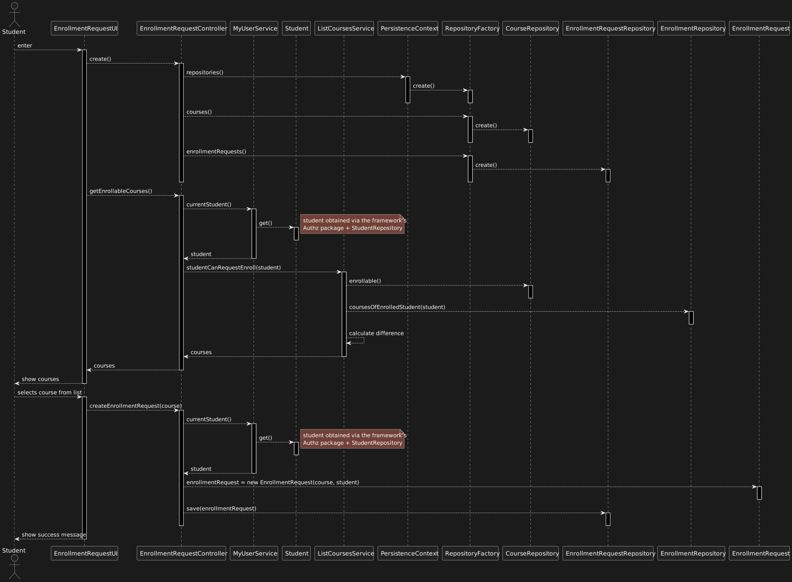

US 1008 -- Request my enrollment in a course
==============================

# Analysis

## Business rules

A student can request enrollment in a course if:
- The course is open to enrollments
- The student is not already enrolled in the course

## Unit tests

1. ensureCourseIsOpenToEnrollments
2. ensureStudentIsNotAlreadyEnrolled
3. ensureStudentCanRequestEnrollment

# Design

The system consists of two primary components, namely the **EnrollmentRequestUI** and the **EnrollmentRequestController**. 
The former is responsible for receiving user input and displaying relevant information to the user, while the latter is 
responsible for implementing the system's business logic and interacting with the domain classes.

In order to ensure a user-friendly experience, the **EnrollmentRequestUI** provides a list of courses that are available 
for enrollment, thereby enabling the user to select the course of their choice. To minimize coupling between the UI 
and the domain classes, the system also employs the DTO pattern while handling with **Courses** and their states.

To prevent code duplication, the **strategy pattern** is utilized in the **ListCoursesService**, as in **us_1004**. 
Specifically, the service offers a `ofStates(states)` method that provides a list of courses whose state matches any of 
the states provided. 
This approach not only increases the flexibility of the service, but also allows it to be used in other use cases that 
require a list of courses with specific states.

Additionally, for ease of use, the service provides an `enrollable()` method that internally calls `ofStates()`. 
This further enhances the service's usability and makes it more efficient.

## Classes

- Domain:
    + **Course**
    + **CourseState**
    + **EnrollmentRequest**
    + **EnrollmentRequestState**
    + **DeniedReason**
- Controller:
    + **EnrollmentRequestController**
    + **ListCoursesService**
- Repository:
    + **CourseRepository**
    + **EnrollmentRequestRepository**
- DTO:
    + **CourseAndStateDTO**
    + **CourseAndStateDTOMapper**

## Sequence Diagram

