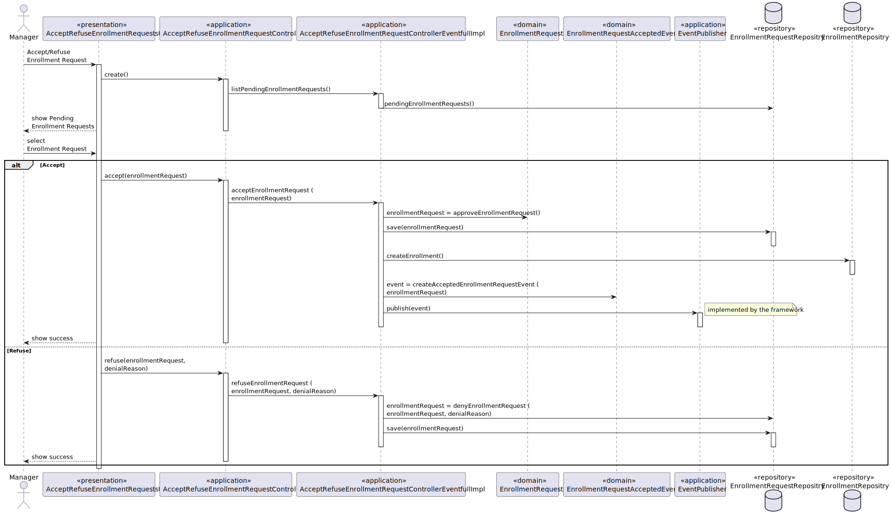

US 1009 -- Approve or reject enrollment requests to a course
========================================================

# Analysis
## Business rules

- To approve or reject an enrollment request, the following business rules must be met:
- The request may be on `PENDING` state.
- A single student can have more than one course enrolled at the same time.

## Unit tests

1. testCourseNameEmptyThrowsIllegalArgumentException
2. testUsernameEmptyThrowsIllegalArgumentException
3. testEnrollmentRequestNormalUse
4. testSameAsReturnsTrueWhenComparedToItself 
5. testSameAsReturnsTrueWhenComparedToIdenticalRequest
6. testSameAsReturnsFalseWhenComparedToRequestWithDifferentCourseName
7. testSameAsReturnsFalseWhenComparedToRequestWithDifferentUsername
8. testSameAsReturnsFalseWhenComparedToNonEnrollmentRequestObject
9. testNewEnrollmentRequestHasPendingState
10. testApproveEnrollmentRequestChangesStateToApproved
11. testDenyEnrollmentRequestChangesStateToDenied
12. testCannotApproveDeniedEnrollmentRequest
13. testCannotApproveApprovedEnrollmentRequest
14. testCannotDenyApprovedEnrollmentRequest
15. testCannotDenyDeniedEnrollmentRequest
16. testCannotGetDeniedReasonFromNotDeniedEnrollmentRequest

# Design

- The only user that will receive a notification is the student that was approved the request.

- The enrollment request will still be on the **enrollmentRequestRepository** after
it's approved or denied, and a new one created for the student that was approved named **enrollmentRepository**.

- An event was developed to notify the student that was approved the request.

## Classes
- Domain:
    + **EnrollmentRequest**
    + **Enrollment**
  - Events:
    + **EnrollmentRequestAcceptedEvent**
- Controller:
  + **AcceptRefuseEnrollmentRequestController**
  + **AcceptRefuseEnrollmentRequestControllerEventfullImpl**
- Repository:
    + **EnrollmentRequestsRepository**
    + **EnrollmentRepository**

## Sequence diagram

