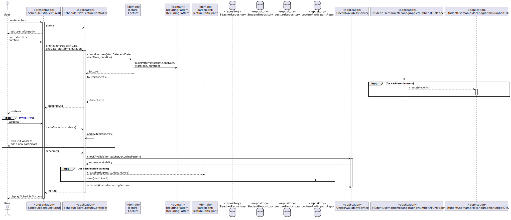

US 1011 -- Schedule an Extraordinary Lecture
========================================================

# Analysis
## Business rules

- A teacher must be able to schedule an extra **Lecture** with a given **duration**
- For a Lecture to be scheduled only is needed to know if the teacher is available
- A lecture has a recursion of **weekly** meaning that the lecture will be repeated every week or only
  **once**. In this case, we will only work with the **once** option.

## Unit tests

In order to accurately test this functionality, we need to interact
with the Aggregate Root repositories, meaning unit tests aren't the best approach here.

Instead, integration tests should be performed.

# Design

The event(lecture) scheduled will be mostly handled by the **TimeTableService** which will implement:

1. `checkAvailabilityByUser(SystemUser user, RecurringPattern pattern)` --- check user availability for a given pattern
2. `createEventService(Iterable<SystemUser> users, RecuringPattern pattern)` --- adds the given pattern to the timeTable of all users

At the time that the lecture is created, it is also needed to create the corresponding lectureParticipants

## Classes
- Domain:
    + **Lecture**
    + **LectureParticipant**
    + **LectureType**
- Controller:
    + **CheckAvailabilityService**
    + **ScheduleLectureController**
- Repository:
    + **LectureParticipantRepository**
    + **LectureRepository**
    + **TeacherRepository**
    + **StudentRepository**
    + **TimeTableRepository**

## Sequence diagram

