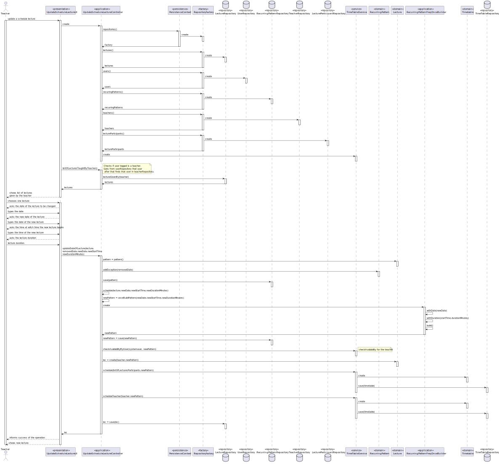

US 1012 -- Update the schedule of a class
========================================================

# Analysis
## Business rules

- A teacher must be able to update the schedule of a **Lecture** with a given **duration**.
- For a Lecture to be updated only is needed to know if the teacher is available, teaches that lecture and the date to be updated.
- A lecture has a recursion of **weekly** meaning that the lecture will be repeated every week or 
**one** that will be repeated only once.
- For the lecture that will be updated we can even change the duration of the lecture be taught.
- This lecture that will be updated has a recurring pattern and a beginning date and a end date, for this porpouse 
when a lecture its updated the date to be updated needs to be between this dates(eg. when a semester is over
it will not make sense to schedule a class after that).

## Unit tests

In order to accurately test this functionality, we need to interact
with the Aggregate Root repositories, meaning unit tests aren't the best approach here.

Instead, integration tests should be performed.

# Design

The event(lecture) scheduled will be mostly handled by the **TimeTableService** which will implement:

1. `checkAvailabilityByUser(SystemUser user, RecurringPattern pattern)` --- check user(teacher) availability for a given pattern
2. `scheduleTeacher(SystemUser user, RecurringPattern pattern)` --- adds the given pattern to the timeTable of the teacher
3. `schedule(Collection<SystemUser> users, RecurringPattern pattern)` --- adds the given pattern to the timeTable of all users(student)

- At the time that the lecture is updated, it is also needed to update the corresponding schedule of the teacher and students participants of that class.
- The recurring pattern of the lecture will have a list of exceptions to encompass the case of being updated,
  in this case when a lecture is updated an exception will be added to the list.
- A new "one recurring pattern" will be created for this case, meaning a lecture will be created and be taught outside the normal scope
  of the weekly normal schedule.
- This lecture that will be taught can have a different duration. 

- The new date will be checks if it's valid before the exception its added to the recurring patter:

1. `addException(LocalDate date)` --adds the exception
2. `betweenDates(LocalDate ex)` -- checks if the date its valid to be added , meaning its after the start date and before the end date of the reccuring pattern

## Classes

- UI:
  + **UpdateScheduleLectureUI**

- Domain:
    + **Lecture**
    + **LectureParticipant**
    + **RecurringPattern**
    + **Timetable**
- Controller:
    + **CheckAvailabilityService**
    + **UpdateScheduleLectureController**
- Repository:
    + **LectureParticipantRepository**
    + **LectureRepository**
    + **TeacherRepository**
    + **StudentRepository**
    + **TimeTableRepository**
    + **UserRepository**
    + **RecurringPatternRepository**

## Sequence diagram

