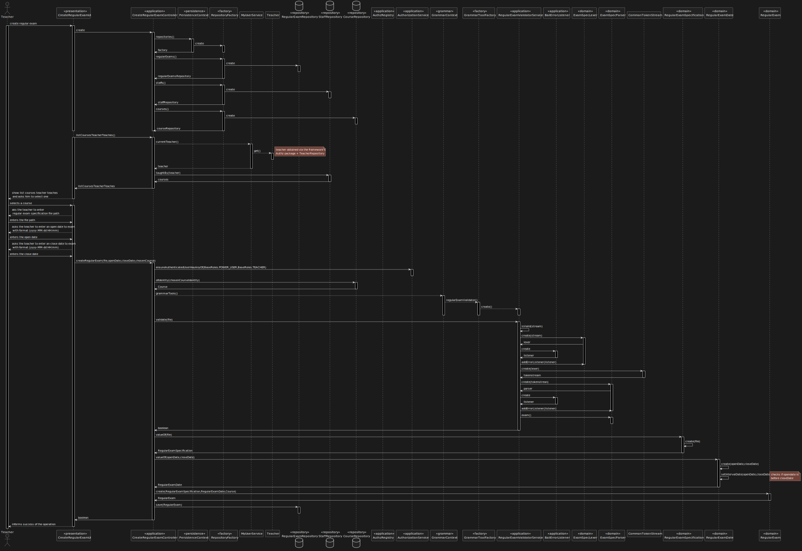

US 2002 -- As Teacher, I want to create/update an exam
==============================

# Analysi

## Business rules

- When creating a regular exam the specification of the exam must follow certain rules, specified in a grammar.
- The exam must have a open/close date.
- A teacher can create exams for any of the courses he is a staff member.

## Unit tests

- No tests needed for grammar and files used.

# Design

- Used a parser to file related to regular exam specification.
- Find courses taught by the teacher logged.
- Validate the file used to test the grammar created.
- Verify if the user logged is indeed a teacher.
- Save regular exam created in repository.
- Verify if the dates used to create an exam are valid.

## Classes

- Domain:
    + **ExamSpecLexer**
    + **ExamSpecParser**
    + **ExamSpecBaseVisitor**
    + **ExamSpecVisitor**
    + **RegularExamSpecification**
    + **RegularExamDate**
    + **RegularExam**
- UI:
    + **CreateRegularExamUI**
- Application:
    + **CreateRegularExamController**
    + **AuthzRegistry**
    + **AuthorizationService**
    + **UserSession**
    + **ValidateRegularExamSpecificationService**
    + **BailErrorListener**
- Repository:
    + **RepositoryFactory**
    + **RegularExamRepository**
    + **StaffRepository**
    + **TeacherRepository**
    + **CourseRepository**
- Persistence:
    + **PersistenceContext**
- Others:
  + **CommonTokenStream**

## Sequence Diagram

