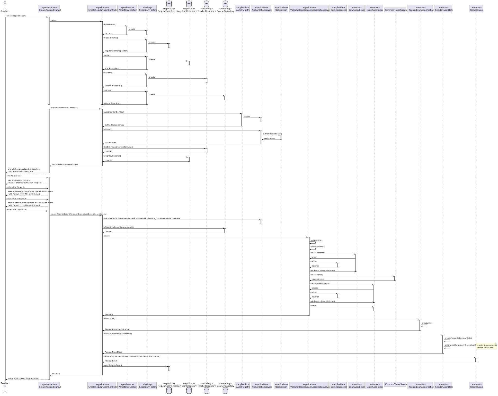

US 2001 -- As Teacher, I want to create an exam
==============================

# Analysis

## Business rules

- When creating a regular exam the specification of the exam must follow certain rules, specified in a grammar.
- The exam must have a open/close date.
- A teacher can create exams for any of the courses he is a staff member.

## Unit tests

- No tests needed for grammar and files used.
- Tests done in `RegularExam`, `RegularExamDate` and `RegularExamSpecification`, see the end of file.

# Design

Even though the client has specified that the **ANTLR** should be used,
since this is essentially a service exterior to our domain, code that
interacts with the ANTLR/grammar components must **protected from future variations**.

Therefore, a mechanism similar to that of the persistence layer should be implemented:

- Creation of a **GrammarContext** class that handles the **GrammarToolsFactory**
- Implementation of a grammar validator for formative exams/regular exams/questions
for each of the supported backends (currently only ANTLR)
- Dynamic loading of the appropriate classes using the Java Reflections API®.


- Used a parser to file related to regular exam specification, the file is validated by the grammar.
- Find courses taught by the teacher logged.
- Validate the file used to test the grammar created.
- Verify if the user logged is indeed a teacher.
- Save regular exam created in repository.
- Verify if the dates used to create an exam are valid.
- The exam as an open date and close date in format (`dd-MM-yyyy HH:mm`).

## Classes

- Domain:
    + **ExamSpecLexer**
    + **ExamSpecParser**
    + **ExamSpecBaseVisitor**
    + **ExamSpecVisitor**
    + **RegularExamSpecification**
    + **RegularExamDate**
    + **RegularExam**
- UI:
    + **CreateRegularExamUI**
- Application:
    + **CreateRegularExamController**
    + **AuthzRegistry**
    + **AuthorizationService**
    + **UserSession**
    + **BailErrorListener**
- Grammar:
    + **RegularExamValidatorService**
- Repository:
    + **RepositoryFactory**
    + **RegularExamRepository**
    + **StaffRepository**
    + **TeacherRepository**
    + **CourseRepository**
- Persistence:
    + **PersistenceContext**
- Others:
    + **CommonTokenStream**


## Sequence Diagram




## RegularExam
```bash
  private RegularExamDate regularExamDate;
    private Course course;

    @Before
    public void BeforeEach() {
        String openDateString = "2023-10-10 16:00";
        String closeDateString = "2023-10-10 18:00";

        SimpleDateFormat df = new SimpleDateFormat("yyyy-MM-dd HH:mm");

        try {
            Date openDate = df.parse(openDateString);
            Date closeDate = df.parse(closeDateString);
            regularExamDate = RegularExamDate.valueOf(openDate, closeDate);
        } catch (ParseException e) {
            throw new RuntimeException(e);
        }

        String startDateString = "1/1/2020";
        String endDateString = "1/1/2023";

        SimpleDateFormat dfx = new SimpleDateFormat("dd/MM/yyyy");

        try {
            Date startDate = dfx.parse(startDateString);
            Date endDate = dfx.parse(endDateString);
            course = new Course(CourseName.valueOf("curso") , CourseDescription.valueOf("descrição"), startDate, endDate);
        } catch (ParseException e) {
            throw new RuntimeException(e);
        }
    }

    @Test
    public void testEquals() {
        // Prepare
        RegularExamSpecification specification = new RegularExamSpecification("Test Specification");
        RegularExam exam1 = new RegularExam(specification, regularExamDate, course);
        RegularExam exam2 = new RegularExam(specification, regularExamDate, course);
        RegularExam exam3 = new RegularExam(specification, regularExamDate, course);

        // Verify
        assertTrue(exam1.equals(exam1)); // Same instance
        assertTrue(exam1.equals(exam2)); // Same attributes
        assertFalse(exam1.equals(null)); // Null comparison
    }

    @Test
    public void testHashCode() {
        // Prepare
        RegularExamSpecification specification = new RegularExamSpecification("Test Specification");
        RegularExam exam1 = new RegularExam(specification, regularExamDate, course);
        RegularExam exam2 = new RegularExam(specification, regularExamDate, course);

        // Verify
        assertEquals(exam1.hashCode(), exam2.hashCode());
    }

    @Test
    public void sameAs() {
        // Prepare
        RegularExamSpecification specification = new RegularExamSpecification("Test Specification");
        RegularExam exam1 = new RegularExam(specification, regularExamDate, course);
        RegularExam exam2 = new RegularExam(specification, regularExamDate, course);
        RegularExam exam3 = new RegularExam(specification, regularExamDate, course);
        String differentClass = "This is a different class";

        // Verify
        assertTrue(exam1.sameAs(exam1)); // Same instance
        assertTrue(exam1.sameAs(exam2)); // Same attributes
        assertFalse(exam1.sameAs(differentClass)); // Different instance
        assertFalse(exam1.sameAs(null)); // Null comparison
        assertFalse(exam1.sameAs(course)); // Different class
    }

    @Test
    public void compareTo() {
        // Prepare
        RegularExamSpecification specification = new RegularExamSpecification("Test Specification");
        RegularExam exam1 = new RegularExam(specification, regularExamDate, course);
        RegularExam exam2 = new RegularExam(specification, regularExamDate, course);

        // Verify
        assertEquals(0, exam1.compareTo(exam2.identity()));
    }

    @Test
    public void identity() {
        // Prepare
        RegularExamSpecification specification = new RegularExamSpecification("Test Specification");
        RegularExam exam = new RegularExam(specification, regularExamDate, course);

        // Verify
        assertEquals(exam.identity(), exam.identity());
    }

    @Test
    public void hasIdentity() {
        // Prepare
        RegularExamSpecification specification = new RegularExamSpecification("Test Specification");
        RegularExam exam = new RegularExam(specification, regularExamDate, course);

        // Verify
        assertTrue(exam.hasIdentity(exam.identity()));
        assertFalse(exam.hasIdentity(123)); // Different identity
    }

    @Test
    public void course() {
        // Prepare
        RegularExamSpecification specification = new RegularExamSpecification("Test Specification");
        RegularExam exam = new RegularExam(specification, regularExamDate, course);

        // Execute
        Course result = exam.course();

        // Verify
        assertEquals(course, result);
    }

    @Test
    public void regularExamDate() {
        // Prepare
        RegularExamSpecification specification = new RegularExamSpecification("Test Specification");
        RegularExam exam = new RegularExam(specification, regularExamDate, course);

        // Execute
        RegularExamDate result = exam.regularExamDate();

        // Verify
        assertEquals(regularExamDate, result);
    }

    @Test
    public void regularExamSpecification() {
        // Prepare
        RegularExamSpecification specification = new RegularExamSpecification("Test Specification");
        RegularExam exam = new RegularExam(specification, regularExamDate, course);

        // Execute
        RegularExamSpecification result = exam.regularExamSpecification();

        // Verify
        assertEquals(specification, result);
    }

    @Test
    public void testProtectedConstructor() {
        // Execute
        RegularExam exam = new RegularExam();

        // Verify
        assertNull(exam.regularExamSpecification());
        assertNull(exam.regularExamDate());
        assertNull(exam.course());
    }

    @Test
    public void updateRegularExamDate_ShouldUpdateDate() {
        RegularExamSpecification specification = new RegularExamSpecification("Sample Specification");
        RegularExam exam = new RegularExam(specification, regularExamDate, course);

        // Arrange
        RegularExamDate newDate = RegularExamDate.valueOf(regularExamDate.openDate(), regularExamDate.closeDate());

        // Act
        exam.updateRegularExamDate(newDate);

        // Assert
        assertEquals(newDate, exam.regularExamDate());
    }

    @Test
    public void updateRegularExamSpecification_ShouldUpdateSpecification() {
        // Arrange
        RegularExamSpecification newSpecification = new RegularExamSpecification("New Specification");
        RegularExam exam = new RegularExam(newSpecification, regularExamDate, course);
        // Act
        exam.updateRegularExamSpecification(newSpecification);

        // Assert
        assertEquals(newSpecification, exam.regularExamSpecification());
    }

```


## RegularExamDateTest
```bash
private RegularExamDate regularExamDate;

    @Before
    public void BeforeEach() {
        String openDateString = "2023-10-10 16:00";
        String closeDateString = "2023-10-10 18:00";

        SimpleDateFormat df = new SimpleDateFormat("yyyy-MM-dd HH:mm");

        try {
            Date openDate = df.parse(openDateString);
            Date closeDate = df.parse(closeDateString);
            regularExamDate = RegularExamDate.valueOf(openDate, closeDate);
        } catch (ParseException e) {
            throw new RuntimeException(e);
        }
    }

    @Test
    public void valueOf() {
        String startDateString = "2023-10-10 16:00";
        String endDateString = "2023-10-10 18:00";

        SimpleDateFormat df = new SimpleDateFormat("yyyy-MM-dd HH:mm");

        try {
            Date startDate = df.parse(startDateString);
            Date endDate = df.parse(endDateString);
            RegularExamDate createdDate = RegularExamDate.valueOf(startDate, endDate);
            Assertions.assertEquals(startDate, createdDate.openDate());
            Assertions.assertEquals(endDate, createdDate.closeDate());
        } catch (ParseException e) {
            throw new RuntimeException(e);
        }

    }

    @Test
    public void setIntervalDate_InvalidDates_ReturnsFalse() {
        String startDateString = "2023-10-10 16:00";
        String endDateString = "2023-10-10 14:00";

        SimpleDateFormat df = new SimpleDateFormat("yyyy-MM-dd HH:mm");

        try {
            Date startDate = df.parse(startDateString);
            Date endDate = df.parse(endDateString);
            RegularExamDate createdDate = RegularExamDate.valueOf(startDate, endDate);
            Assertions.assertEquals(createdDate.openDate(), null);
        } catch (ParseException e) {
            throw new RuntimeException(e);
        }
    }

    @Test
    public void testEquals_SameDates_ReturnsTrue() {
        String startDateString = "2023-10-10 16:00";
        String endDateString = "2023-10-10 18:00";

        SimpleDateFormat df = new SimpleDateFormat("yyyy-MM-dd HH:mm");

        try {
            Date startDate = df.parse(startDateString);
            Date endDate = df.parse(endDateString);
            RegularExamDate date1 = new RegularExamDate(startDate, endDate);
            RegularExamDate date2 = new RegularExamDate(startDate, endDate);
            Assertions.assertEquals(date1, date2);
        } catch (ParseException e) {
            throw new RuntimeException(e);
        }
    }

    @Test
    public void openDate_ReturnsCorrectValue() {
        String expectedDateString = "2023-10-10 16:00";
        SimpleDateFormat df = new SimpleDateFormat("yyyy-MM-dd HH:mm");

        try {
            Date expectedDate = df.parse(expectedDateString);
            Date openDate = regularExamDate.openDate();
            Assertions.assertEquals(expectedDate, openDate);
        } catch (ParseException e) {
            throw new RuntimeException(e);
        }
    }

    @Test
    public void closeDate_ReturnsCorrectValue() {
        String expectedDateString = "2023-10-10 18:00";
        SimpleDateFormat df = new SimpleDateFormat("yyyy-MM-dd HH:mm");

        try {
            Date expectedDate = df.parse(expectedDateString);
            Date closeDate = regularExamDate.closeDate();
            Assertions.assertEquals(expectedDate, closeDate);
        } catch (ParseException e) {
            throw new RuntimeException(e);
        }
    }

    @Test
    public void testEquals_DifferentDates_ReturnsFalse() {
        String startDateString1 = "2023-10-10 16:00";
        String endDateString1 = "2023-10-10 18:00";
        String startDateString2 = "2023-10-10 19:00";
        String endDateString2 = "2023-10-10 20:00";

        SimpleDateFormat df = new SimpleDateFormat("yyyy-MM-dd HH:mm");

        try {
            Date startDate1 = df.parse(startDateString1);
            Date endDate1 = df.parse(endDateString1);
            Date startDate2 = df.parse(startDateString2);
            Date endDate2 = df.parse(endDateString2);
            RegularExamDate date1 = new RegularExamDate(startDate1, endDate1);
            RegularExamDate date2 = new RegularExamDate(startDate2, endDate2);
            Assertions.assertNotEquals(date1, date2);
        } catch (ParseException e) {
            throw new RuntimeException(e);
        }
    }

    @Test
    public void testHashCode_SameDates_ReturnsSameHashCode() {
        String startDateString = "2023-10-10 16:00";
        String endDateString = "2023-10-10 18:00";

        SimpleDateFormat df = new SimpleDateFormat("yyyy-MM-dd HH:mm");

        try {
            Date startDate = df.parse(startDateString);
            Date endDate = df.parse(endDateString);
            RegularExamDate date1 = new RegularExamDate(startDate, endDate);
            RegularExamDate date2 = new RegularExamDate(startDate, endDate);
            Assertions.assertEquals(date1.hashCode(), date2.hashCode());
        } catch (ParseException e) {
            throw new RuntimeException(e);
        }
    }

    @Test
    public void testHashCode_DifferentDates_ReturnsDifferentHashCode() {
        String startDateString1 = "2023-10-10 16:00";
        String endDateString1 = "2023-10-10 18:00";
        String startDateString2 = "2023-10-10 19:00";
        String endDateString2 = "2023-10-10 20:00";

        SimpleDateFormat df = new SimpleDateFormat("yyyy-MM-dd HH:mm");

        try {
            Date startDate1 = df.parse(startDateString1);
            Date endDate1 = df.parse(endDateString1);
            Date startDate2 = df.parse(startDateString2);
            Date endDate2 = df.parse(endDateString2);
            RegularExamDate date1 = new RegularExamDate(startDate1, endDate1);
            RegularExamDate date2 = new RegularExamDate(startDate2, endDate2);
            Assertions.assertNotEquals(date1.hashCode(), date2.hashCode());
        } catch (ParseException e) {
            throw new RuntimeException(e);
        }
    }

    @Test
    public void defaultConstructor_OpenDateAndCloseDateAreNull() throws NoSuchFieldException, IllegalAccessException {
        // Create an instance of RegularExamDate using the protected constructor
        RegularExamDate regularExamDate = createRegularExamDateWithDefaultConstructor();

        // Use reflection to access the openDate and closeDate fields
        Field openDateField = RegularExamDate.class.getDeclaredField("openDate");
        openDateField.setAccessible(true);
        Field closeDateField = RegularExamDate.class.getDeclaredField("closeDate");
        closeDateField.setAccessible(true);

        // Verify that the openDate and closeDate fields are null
        Assertions.assertNull(openDateField.get(regularExamDate));
        openDateField.setAccessible(false);
        Assertions.assertNull(closeDateField.get(regularExamDate));
        closeDateField.setAccessible(false);

    }

    public RegularExamDate createRegularExamDateWithDefaultConstructor() {
        return new RegularExamDate() {
            // A subclass with an empty body is created to access the protected constructor
        };
```

## RegularExamSpecification
```bash
@Test
    public void valueOf() {
        // Prepare
        String specification = "This is a test specification";
        RegularExamSpecification expected = new RegularExamSpecification(specification);

        List<String> lines = new ArrayList<>();
        lines.add(specification);

        // Execute
        RegularExamSpecification result = RegularExamSpecification.valueOf(lines);

        // Verify
        Assertions.assertEquals(expected, result);
    }

    @Test
    public void testValueOf() throws IOException {
        // Prepare
        String filePath = "path/to/specification.txt";
        String specification = "This is a test specification";
        File file = new File(filePath);
        FileUtils.writeStringToFile(file, specification, StandardCharsets.UTF_8);
        RegularExamSpecification expected = new RegularExamSpecification(specification);

        // Execute
        RegularExamSpecification result = RegularExamSpecification.valueOf(file);

        // Verify
        Assertions.assertEquals(expected, result);

        // Cleanup
        FileUtils.deleteQuietly(file);
    }

    @Test
    public void specificationString() {
        // Prepare
        String specification = "This is a test specification";
        RegularExamSpecification regularExamSpecification = new RegularExamSpecification(specification);

        // Execute
        String result = regularExamSpecification.specificationString();

        // Verify
        Assertions.assertEquals(specification, result);
    }

    @Test
    public void testEquals() {
        // Prepare
        RegularExamSpecification spec1 = new RegularExamSpecification("Specification 1");
        RegularExamSpecification spec2 = new RegularExamSpecification("Specification 1");
        RegularExamSpecification spec3 = new RegularExamSpecification("Specification 2");

        // Verify
        Assertions.assertEquals(spec1, spec2);
        Assertions.assertNotEquals(spec1, spec3);
        Assertions.assertNotEquals(spec2, spec3);
    }

    @Test
    public void equalsSameInstance() {
        // Prepare
        RegularExamSpecification specification = new RegularExamSpecification("Test Specification");

        // Execute and Verify
        assertTrue(specification.equals(specification));
    }

    @Test
    public void equalsNullObject() {
        // Prepare
        RegularExamSpecification specification = new RegularExamSpecification("Test Specification");

        // Execute and Verify
        assertFalse(specification.equals(null));
    }

    @Test
    public void equalsDifferentClass() {
        // Prepare
        RegularExamSpecification specification = new RegularExamSpecification("Test Specification");
        String differentClass = "This is a different class";

        // Execute and Verify
        assertFalse(specification.equals(differentClass));
    }

    @Test
    public void testHashCode() {
        // Prepare
        RegularExamSpecification spec1 = new RegularExamSpecification("Specification 1");
        RegularExamSpecification spec2 = new RegularExamSpecification("Specification 1");

        // Verify
        Assertions.assertEquals(spec1.hashCode(), spec2.hashCode());
    }

    @Test
    public void testToString() {
        // Prepare
        String specification = "This is a test specification";
        RegularExamSpecification regularExamSpecification = new RegularExamSpecification(specification);
        String expected = String.format(specification);

        // Execute
        String result = regularExamSpecification.toString();

        // Verify
        Assertions.assertEquals(expected, result);
    }

    @Test
    public void protectedConstructor()
            throws NoSuchMethodException, IllegalAccessException, InvocationTargetException, InstantiationException {
        // Obtain the constructor
        Constructor<RegularExamSpecification> constructor = RegularExamSpecification.class.getDeclaredConstructor();

        // Ensure accessibility of the constructor
        constructor.setAccessible(true);

        // Create an instance using the protected constructor
        RegularExamSpecification instance = constructor.newInstance();

        // Verify that the specification is null
        assertNull(instance.specificationString());
        constructor.setAccessible(false);
    }
```
