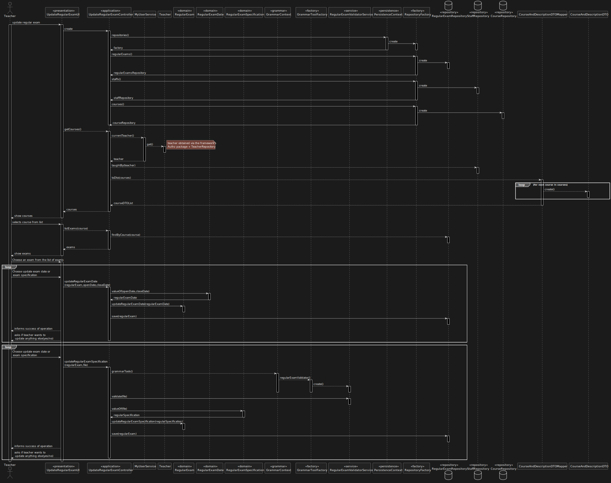

US 2001 -- As Teacher, I want to update an exam
==============================

# Analysis

## Business rules

- The teacher can update the open/ close date of an exam.
- The teacher can update the specification of the exam.
- A teacher can update exams for any of the courses he is a staff member.

## Unit tests

- No tests needed for grammar and files used.

# Design

- Used a parser to file related to regular exam specification.
- Find courses taught by the teacher logged.
- Validate the file used to test the grammar created.
- Verify if the user logged is indeed a teacher.
- Save regular exam updated in repository.
- Verify if the dates used to update an exam are valid.

## Classes
Even though the client has specified that the **ANTLR** should be used,
since this is essentially a service exterior to our domain, code that
interacts with the ANTLR/grammar components must **protected from future variations**.

Therefore, a mechanism similar to that of the persistence layer should be implemented:

- Creation of a **GrammarContext** class that handles the **GrammarToolsFactory**
- Implementation of a grammar validator for formative exams/regular exams/questions
for each of the supported backends (currently only ANTLR)
- Dynamic loading of the appropriate classes using the Java Reflections API®.

- Domain:
    + **RegularExamSpecification**
    + **RegularExamDate**
    + **RegularExam**
- UI:
    + **UpdateRegularExamUI**
- Application:
    + **UpdateRegularExamController**
- Grammar:
    + **RegularExamValidatorService**
- Repository:
    + **RepositoryFactory**
    + **RegularExamRepository**
    + **StaffRepository**
    + **TeacherRepository**
    + **CourseRepository**
- Persistence:
    + **PersistenceContext**
- DTO:
    + **CourseAndDescriptionDTOMapper**
    + **CourseAndDescriptionDTO**

## Sequence Diagram

