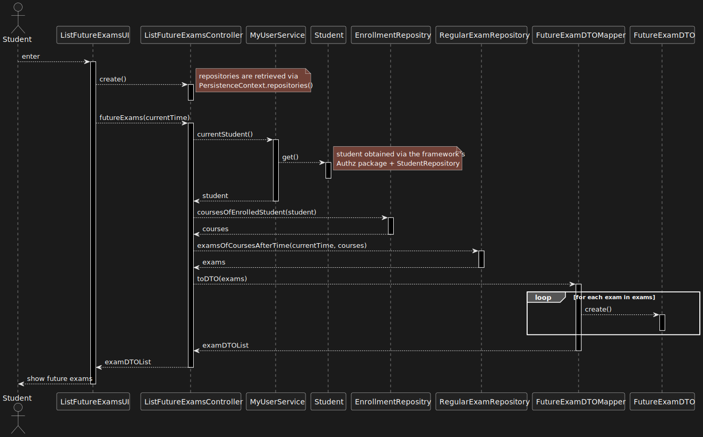

US 2002 --- As Student, I want to view a list of my future exams
================================================================

# Analysis

## Business Rules
Student should be able to view all of the exams of all the courses they're enrolled in
as long as the start time of the exam is after "right now"
## Unit tests

In order to accurately test this functionality, we need to interact
with the Aggregate Root repositories, meaning unit tests aren't the best approach here.

Instead, integration tests should be performed.
# Design
An `examsOfCoursesAfterTime` method should be implemented in the **Regular Exam**
repository (*information expert*) to list all of the exams of a given set of courses
whose start time is **after** a parameterized time (*dependency injection*).

The courses a given student is enrolled in will be obtained via the **Enrollment repository**.

In order to reduce coupling between the Domain and Presentation classes,
**DTO** object will be used.

## Classes
- Domain:
    + **RegularExam**
    + **RegularExamDate**
    + **Student**
    + **Course**
- Controller:
    + **ListFutureExamsController**
- Repository:
    + **StudentRepository**
    + **EnrollmentRepository**
    + **RegularExamRepository**
- DTO:
    + **FutureExamDTO**
    + **FutureExamDTOMapper**

## Sequence diagram

