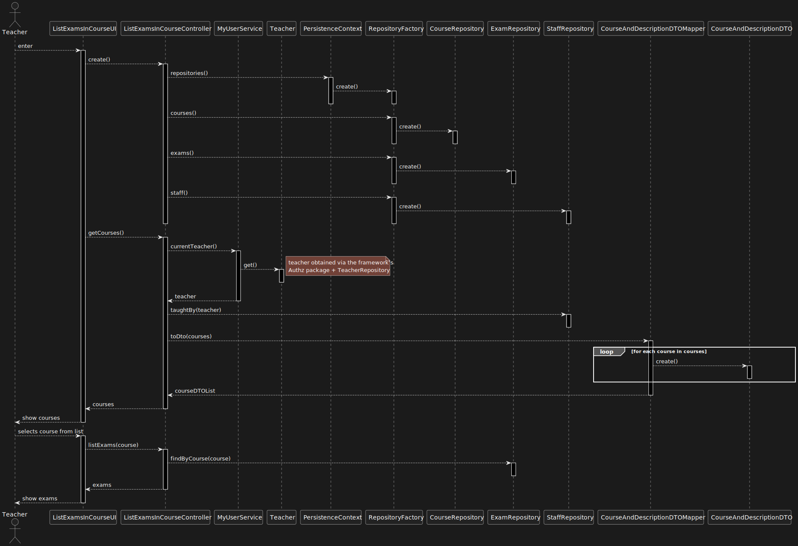

US 2003 -- List exams in a course
==============================

# Analysis

## Business rules

A teacher can list the exams of a course if:
- They are a teacher of the course

## Unit tests

- ensureExamsAreCorrect (integration test)

# Design

The system consists of two primary components, namely the **ListExamsInCourseUI** and the 
**ListExamsInCourseController**. The former is responsible for receiving user input and displaying relevant information
such as courses lists and exams lists (after the exams are selected), while the latter is responsible for implementing
the system's business logic and interacting with the domain classes.

In order to ensure a user-friendly experience, the **ListExamsInCourseUI** provides a list of courses that are available
for listing exams, thereby enabling the user to select the course of their choice and list the exams of that course.

In order to find the courses taught by a specific user (teacher), the **StaffRepository** implements a 
`taughtBy()` method that returns an iterable of courses. 

Both **CourseAndDescriptionDTO** and **CourseAndDescriptionDTOMapper** are used to map the **Course** domain class to a
DTO, which is then used by the **ListExamsInCourseUI** to display the courses to the user.

## Classes

- Domain:
    + **Course**
    + **CourseState**
    + **RegularExam**
    + **Teacher**
- Controller:
    + **ListExamsInCourseController**
- Repository:
    + **CourseRepository**
    + **RegularExamRepository**
    + **TeacherRepository**
    + **StaffRepository**
- DTO:
    + **CourseAndStateDTO**
    + **CourseAndStateDTOMapper**

## Sequence Diagram

