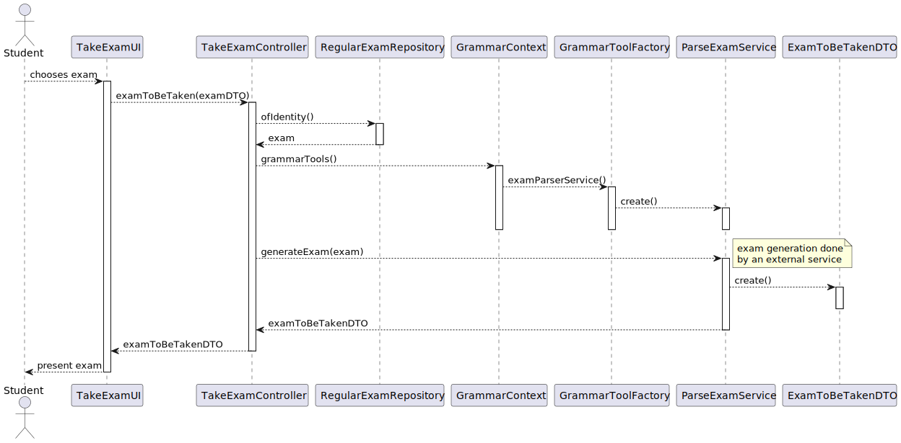
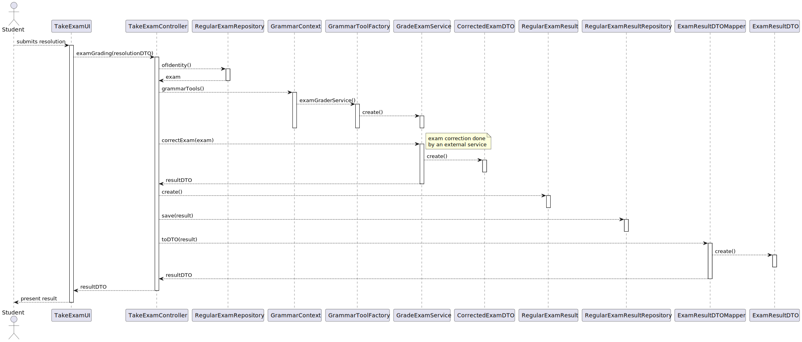

US_2004 --- Student - Take an Exam
==================================

# Analysis

A student is presented with an exam and they answer its questions.
When they finish and submit their answers, the system should **compute**
the student's **grade** and possible **feedback** by using a **parser** based on
the exam's specification.

## Relevant Forum Questions and Answers

1. From [GAVRIKOVA: US2004 - As Student, I want to take an exam](https://moodle.isep.ipp.pt/mod/forum/discuss.php?d=23402#p29589)
> >  when a student finished taking exam, will he want at some point review the exam and see his answers?
> 
> This is not required.

> > Do we need to save the exam with the answers of a certain student to be able to
    show it later (if needed), or should we just calculate the final grade and show
    feedback for each question (if applicable)?
>
> Just calculate the final grade and show feedback for each question.
  Unless saving of the answers is required as a technical solution for some other
  aspect of your solution you do not need to save the answers.

**Interpretation:** The *resolved exam*
(i.e, the data structure with the student's answers) does not need to be persisted.

> > Another question is about types of feedback: on-submission means on submission
    of a question or the whole exam?
> 
> On submission of the whole exam.

**Interpretation:** The student does not receive any kind of *real-time feedback* while
taking the exam; only when they submit it (provided the feedback type is *on-submission*)

2. From [RENTE: US_2004/2009](https://moodle.isep.ipp.pt/mod/forum/discuss.php?d=23245#p29407)
> > A propósito das US's 2004 e 2009, de que forma é que os exames serão apresentados
    ao aluno para o mesmo os realizar? Será semelhante às boards, em que será criada
    uma página em JavaScript?
> 
> Apenas a aplicação "shared board app" implementa um servidor http para servir
  o "board viewer".
  Todas as outras funcionalidades da solução devem estar distribuídas pelas outras
  "apps", que devem ser java console applications.
  Ou seja, a "user interface" para a funcionalidade dos exames deve ser implementada
  como uma console application.
  A referencia aos "quiz" do moodle é apenas para ilustrar quais as funcionalidades
  pretendidas.
  Mas a sua implementação não necessita de ser realizada em HTML
  (ou seja, não é esperado que o façam).

<!-- TODO check answer -->

3. From [RENTE: US2004 - Realizar um exame](https://moodle.isep.ipp.pt/mod/forum/discuss.php?d=23476#p29702)
> > Relativamente à funcionalidade de realizar um exame, mais concretamente
    à parte de mostrar a nota/feedback com a propriedade "after-closing"
    (referenciado na especificação do sistema), é esperado o aluno ser notificado
    mal a data de fecho do exame seja atingida ou pretende-se apenas que a nota
    possa ser visualizada a partir da funcionalidade correspondente à US2005/2006.
    Caso pretenda que o aluno seja notificado, pergunto-lhe se isto deve ser feito através de uma notificação do sistema ou através de um serviço, por exemplo, email.

<!-- TODO check answer -->

## Business rules
N/A

## Unit tests

# Design

Even though the client has specified that the parser to use is based on
the exam grammar implemented with the **ANTLR** tool, this is an implementation
requirement that is highly susceptible to change in the future.
This requires the implementation of this Use Case to use **Dependency inversion** and
**Protected variations** in order to make future changes --- i.e changing to
a different tool from ANTLR --- a plug-n'-play task.

Thus, the currently implemented **GrammarContext** system will be used to handle
parser implementations from different systems.

<!-- TODO: mention frontend-backend details after the client's answer -->
<!-- TODO: mention feedback -->

## Classes
- Domain:
    + **RegularExam**
    + **ExamResult**
    + **Course**
    + **Student**
- Controller:
    + **TakeExamController**
- Grammar:
    + **ParseExamService**
    + **GradeExamService**
- Repository:
    + **RegularExamRepository**
    + **EnrollmentRepository**
    + **RegularExamResultRepository**
- DTO:
    + **OngoingExamDTO**
    + **OngoingExamDTOMapper**

    + **ExamToBeTakenDTO**

    + **ExamResultDTO**
    + **ExamResultDTOMapper**

## Sequence diagram

This use case was broken down into three parts:

1. Provide the student with a list of exams they can currently take.

](./listOngoingExamsSD.svg)

2. Generate the exam from the stored specification and provide it to the user.

](./examToBeTakenSD.svg)

3. Compute the student's grade and per-question feedback.

](./gradeExamSD.svg)
