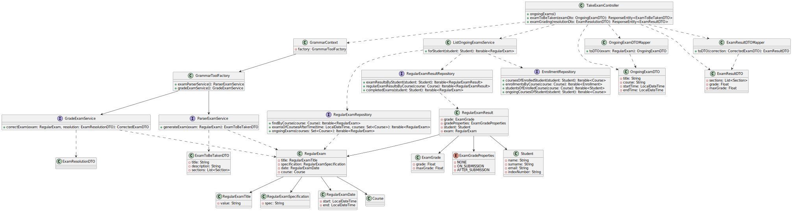

# US 2004 | Student - Take an Exam

## 1. Analysis

A student is presented with an exam and they answer its questions. When they finish and submit their answers, the 
system should **compute**the student's **grade** and possible **feedback** by using a **parser** based on the exam's 
specification.

## 2. Requirements

This use case is based on the following requirements:

- **R1.** The student must be able to see a list of exams they can take.
- **R2.** The student must be able to take an exam.
- **R3.** The student must be able to see their grade and feedback on their performance, for each question.

### 2.1. Questions, Answers and Interpretations

1. From [GAVRIKOVA: US2004 - As Student, I want to take an exam](https://moodle.isep.ipp.pt/mod/forum/discuss.php?d=23402#p29589)

> > when a student finished taking exam, will he want at some point review the exam and see his answers?
>
> This is not required.

> > Do we need to save the exam with the answers of a certain student to be able to
> > show it later (if needed), or should we just calculate the final grade and show
> > feedback for each question (if applicable)?
>
> Just calculate the final grade and show feedback for each question.
> Unless saving of the answers is required as a technical solution for some other
> aspect of your solution you do not need to save the answers.

**Interpretation:** The *resolved exam*
(i.e, the data structure with the student's answers) does not need to be persisted.

> > Another question is about types of feedback: on-submission means on submission
> > of a question or the whole exam?
>
> On submission of the whole exam.

**Interpretation:** The student does not receive any kind of *real-time feedback* while
taking the exam; only when they submit it (provided the feedback type is *on-submission*)

2. From [RENTE: US_2004/2009](https://moodle.isep.ipp.pt/mod/forum/discuss.php?d=23245#p29407)

> > A propósito das US's 2004 e 2009, de que forma é que os exames serão apresentados
> > ao aluno para o mesmo os realizar? Será semelhante às boards, em que será criada
> > uma página em JavaScript?
>
> Apenas a aplicação "shared board app" implementa um servidor http para servir
> o "board viewer".
> Todas as outras funcionalidades da solução devem estar distribuídas pelas outras
"apps", que devem ser java console applications.
> Ou seja, a "user interface" para a funcionalidade dos exames deve ser implementada
> como uma console application.
> A referencia aos "quiz" do moodle é apenas para ilustrar quais as funcionalidades
> pretendidas.
> Mas a sua implementação não necessita de ser realizada em HTML
(ou seja, não é esperado que o façam).

3. From [RENTE: US2004 - Realizar um exame](https://moodle.isep.ipp.pt/mod/forum/discuss.php?d=23476#p29702)

> > Relativamente à funcionalidade de realizar um exame, mais concretamente
> > à parte de mostrar a nota/feedback com a propriedade "after-closing"
(referenciado na especificação do sistema), é esperado o aluno ser notificado
> > mal a data de fecho do exame seja atingida ou pretende-se apenas que a nota
> > possa ser visualizada a partir da funcionalidade correspondente à US2005/2006.
> > Caso pretenda que o aluno seja notificado, pergunto-lhe se isto deve ser feito através de uma notificação do sistema
> > ou
> > através de um serviço, por exemplo, email.
>
> Não consigo encontrar nenhuma referência a uma notificação depois da data de fecho do exame.
> O que vejo é que o sistema deve mostrar o resultado e o feedback no final do exame.
> A questão que se pode colocar é quando é que acontece o "fim do exame".
> Podemos entender que é quando o aluno submete o seu exame ou quando atingimos a data de fecho do exame ("close date").
> Como cliente posso indicar que aceito a primeira interpretação, ou seja, assim que o aluno submete o seu exame, este
> recebe o feedback e nota (de forma sincrona). Penso que em termos de solução será a situação mais simples.
>
> > Tendo em conta que aceita primeira interpretação, qual será a diferença entre on-submission e after-closing?
> > A minha dúvida é principalmente acerca do funcionamento da propriedade after-closing.
>
> A minha indicação anterior é a de que o aluno recebe o feedback e a nota quando submete o exame.
> Em principio o aluno tem de submeter o exame antes do tempo de fecho do exame.
> Se o aluno tentar submeter um exame depois do seu fecho o sistema deve simplesmente não aceitar a entrega/submissão.

4. From [GAVRIKOVA: US2004 - Take an exam - Number of attempts](https://moodle.isep.ipp.pt/mod/forum/discuss.php?d=23481#p29707)

> > When a student takes an exam, should we assume that he has only one attempt,
> > or the number of attempts should be specified in the exam grammar?
>
> There is no mention regarding attempts in the specification,
> therefore there is no need to support that functionality.

5. From [ALVES: US 2004/2009](https://moodle.isep.ipp.pt/mod/forum/discuss.php?d=23236#p29402)

> > First we would like to know if you wish that the grades are saved in the program database.
> > Second we would like for you to clarify the expected flow of both feedback and grade types.
>
> Regarding the first question, if you do not save the grades how do you implement the functionalities of FRE05 and
> FRE06?
> Regarding the second question, the ideia is to have something very similar to the Moodle platform.
> According to the specification "The system must also support the automatic production of feedback and grading for the
> answers given by students when they take the exam. Usually this is done at the end of the exam."
> So, the grade and the feedback should be provided only and the end of the exam.
> At the end of the exam, the system should display to the student the resulting grade
> of the exam as well as the grade and feedback for each question/answer.
> You may find a simple workflow on how to create moodle tests(quiz) in [Youtube](https://youtu.be/dCDPS7ufGuQ).
> Regarding grades, each question will have points when the answer is correct.
> If you sum all the points form all the answers you will have the grade of the exam.
> Please consider only the question types that are presented in the specification document.
> For each question type you will find further details on the specifics of the grading logic.

**Interpretation:** Since the maximum number of attempts is unspecified, students
will only have a single attempt when taking exams.

## 3. Design

### 3.1. Realization

This use case was broken down into three parts:

1. Provide the student with a list of exams they can currently take.

2. Generate the exam from the stored specification and provide it to the user.

3. Compute the student's grade and per-question feedback.

### 3.2. Classes

### 3.3. Applied Patterns

- **Dependency Inversion and Protected Variations:** Even though the client has specified that the parser to use is
  based on the exam grammar implemented with the **ANTLR** tool, this is an implementation requirement that is highly
  susceptible to change in the future.
  This requires the implementation of this Use Case to use **Dependency inversion** and
  **Protected variations** in order to make future changes --- i.e changing to
  a different tool from ANTLR --- a plug-n'-play task.
    - The currently implemented **GrammarContext** system will be used to handle
      parser implementations from different systems.
    - System components that interact with the grammar context will do so via an
      interface that each grammar implementation (*currently only ANTLR is supported*)
      needs to adhere to.
- **DTO**: DTO objects will be used to ensure intermediate system layers need not be
  altered if there is a change in requirements/tooling to use.

### 3.4. Tests

In order to accurately test this functionality, we need to interact
with the Aggregate Root repositories, meaning **unit tests aren't the best approach here**.

Instead, integration tests should be performed.

## 4. Integration/Demonstration

In order to execute this use case, the user should first have at their disposal an exam specification file.
It should be in accordance with the exam grammar specification, more information on which can be found in the
[Exam Specification Manual](../us_2001/grammar_manual.md).

After having the exam specification file, the user should then **run and login to the system as a student**. They should
then navigate to the "Exam" page, where it will be presented an option to take an exam. A website will then open, where
the user can **select and do the exam**. Grading will be done automatically, and the user will be presented
with their grade and feedback for each question after they submit their exam, **depending on the exam's configuration.**

## 5. Observations

This use case was successfully implemented, and **all the requirements were met**. Even though the client did not
specify that the exam should be done in a web browser, this was the chosen implementation method, as it is the most
**user-friendly** and, as a team, we believe it is the most appropriate for this use case.