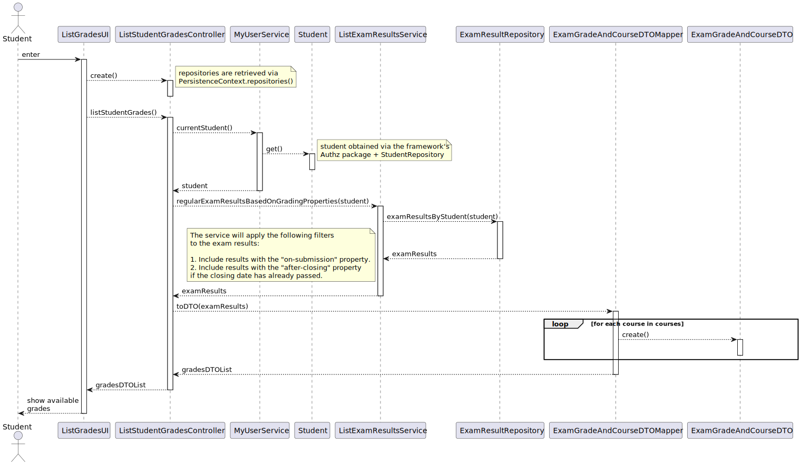

# US 2005 | Student - View a list of my grades

## 1. Analysis

This functionality has to follow specific business rules for it to work
as intended, those business rules are regarding the grading property of the
exam, there are **three** possible properties:

- **None** (the exam doesn't have a grade)
- **On submission** (the grade is released right after the student submits
  an exam)
- **After closing** (the grade is only released after the closing date of
  the exam has occurred)

Following these rules, when a student asks for the system to display their
grades, the system should only display the **available** grades.

Furthermore, after **discussing with the Client**, it was decided that
the system should only display the grades regarding **regular exams**, meaning
that the grades regarding formative exams should not be displayed.

(applicable to
both US2005 and US2006)

## 2. Requirements

The requirements were already stated in the previous section, but to
summarize:
- The system should only display the grades regarding **regular exams**.
- The system should only display the **available** grades, which means:
  - Include results with the *on-submission* property.
  - Include results with the *after-closing* property **only if the closing date** has already passed.
  - 
## 3. Design

### 3.1. Realization

### 3.2. Classes

### 3.3. Applied Patterns

To better answer this problem a service named **ListExamResultsService** will be
implemented with the following method added to it:

- `regularExamResultsBasedOnGradingProperties()`

This method will perform the
needed database search operations in order to find the available exam results,
following the business rules:

1. Include results with the *on-submission* property.
2. Include results with the *after-closing* property **only if the closing date** has already passed.

The **DTO pattern** will be used to display the grades in the UI, alongside with the course from each
exam belongs to.

### 3.4. Tests

In order to accurately test this functionality, we need to interact
with the Aggregate Root repositories, meaning **unit tests aren't the best approach here**.

Instead, integration tests should be performed.

## 4. Integration/Demonstration

In order to execute this use case, the user must have grades available, which means that the user must have 
submitted an exam, the exam must have a grade, and it must be a regular exam. IF the grade is available, the user
can access the "Exams" page, and there will be an option to view the grades, as shown in the following image:

## 5. Observations

This use case was successfully implemented, and **all the requirements were met**.