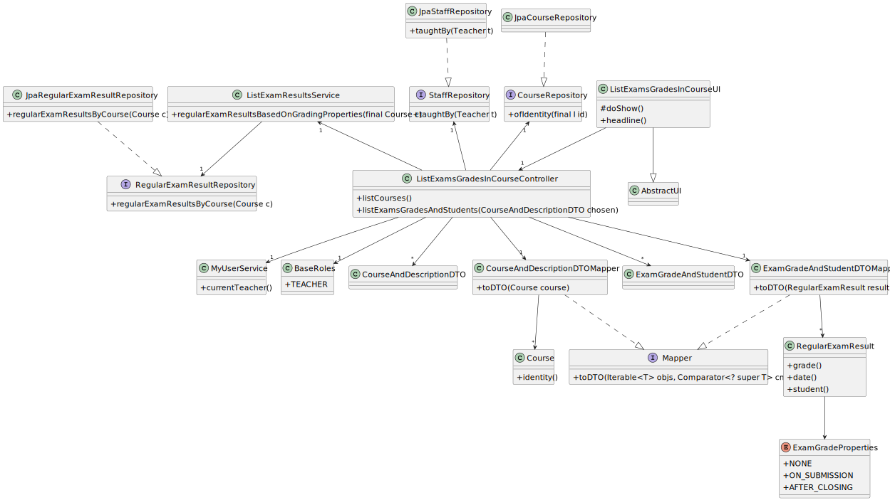
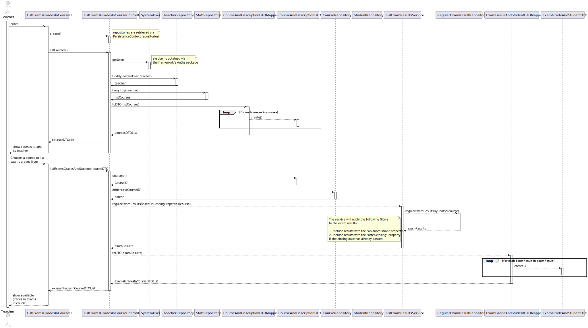

# US 2006

## 1. Context

*As Teacher, I want to view a list of the grades of exams of my courses*

## 2. Requirements

*The main objective of this user story is to list the grades of exams of courses a teacher teaches, this user story as correlation with the following US's:*

**US 1002** As {Manager}, I want to create courses

- We need courses to exit, so we can have teachers associated with them as well as exams.

**US 2001** As {Teacher}, I want to create/update an exam

- We need exams so students can take them and have a grade on that.

## 3. Analysis

This functionality has to follow specific business rules for it to work
as intended, those business rules are regarding the grading property of the
exam, there are **three** possible properties:

- **None** (the exam doesn't have a grade)
- **On submission** (the grade is released right after the student submits
  an exam)
- **After closing** (the grade is only released after the closing date of
  the exam has occurred)

Following these rules, when a teacher asks for the system to display their
grades, the system should only display the **available** grades.

Another rule is that the teacher can only ask the system to display the grades of courses
he teaches.

Teacher as to be a staff member.

## 4. Design

To better answer this problem a service named **ListExamResultsService** will be
implemented with the following method added to it:

- `regularExamResultsBasedOnGradingProperties()`

This method will perform the
needed database search operations in order to find the available exam results,
following the business rules:

1. Include results with the *on-submission* property.
2. Include results with the *after-closing* property **only if the closing date** has already passed.

The **DTO pattern** will be used to display the grades in the UI, alongside with the course from each
exam belongs to.

The **DTO pattern** will be used to display the courses in the UI that a teacher teaches.

### 4.1. Realization

### 4.2. Class Diagram

### 4.2.1 Sequence Diagram

### 4.3. Applied Patterns

- **Factory** - Responsible for creating complex objects or aggregates while encapsulating the creation logic.

- **Repository** - Provides a way to retrieve and persist aggregates.
  + **StaffRepository**
  + **CourseRepository**
  + **RegularExamResultRepository**

- **DTO pattern** - encapsulate data and provide a standardized way to transfer it between different parts of a system.
    + **ExamGradeAndStudentDTO**
    + **ExamGradeAndStudentDTOMapper**
    + **CourseAndDescriptionDTO**
    + **CourseAndDescriptionDTOMapper**

### 4.4. Tests

In order to accurately test this functionality, we need to interact
with the Aggregate Root repositories, meaning unit tests aren't the best approach here.

Instead, integration tests should be performed.

## 5. Implementation

*In this section the team will present, important artifacts necessary to fully understand the implementation like the database operations*

  **JpaBaseRepository**
    
    public Optional<T> ofIdentity(final I id) {
        return this.matchOne("e." + this.identityFieldName() + " = :id", "id", id);
    }

  **JpaStaffRepository**

    public Iterable<Course> taughtBy(Teacher t) {
        final var query = entityManager().createQuery(
                "SELECT sm.course FROM StaffMember sm WHERE sm.member = :teacher",
                Course.class);
        query.setParameter("teacher", t);
        return query.getResultList();
    }

  **JpaRegularExamResultRepository**

    public Iterable<RegularExamResult> regularExamResultsByCourse(Course c) {
      return match("e.regularExam.course = :course", "course", c);
    }

## 6. Integration/Demonstration

* A new option on the teacher menu options was added.
* For demo purposes some tasks are bootstrapped while system starts, like courses, teachers, exams, exams results.

## 7. Observations

Nothing to add here.