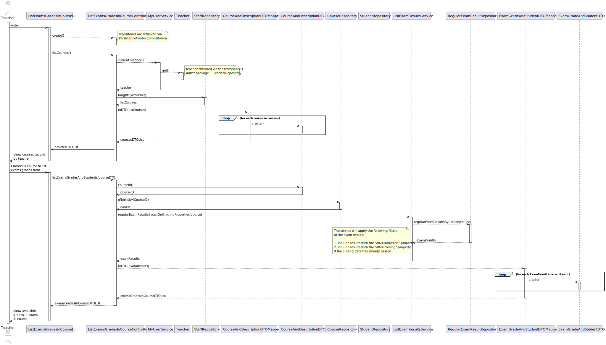

US 2006 -- As Teacher,  I want to view a list of the grades of exams of my courses
=========================================================

# Analysis
## Business rules

This functionality has to follow specific business rules for it to work
as intended, those business rules are regarding the grading property of the
exam, there are **three** possible properties:

- **None** (the exam doesn't have a grade)
- **On submission** (the grade is released right after the student submits
an exam)
- **After closing** (the grade is only released after the closing date of
the exam has occurred)

Following these rules, when a teacher asks for the system to display their
grades, the system should only display the **available** grades.

Another rule is that the teacher can only ask the system to display the grades of courses 
he teaches.

Teacher as to be a staff member.

## Unit tests

In order to accurately test this functionality, we need to interact
with the Aggregate Root repositories, meaning unit tests aren't the best approach here.

Instead, integration tests should be performed.

# Design
To better answer this problem a service named **ListExamResultsService** will be 
implemented with the following method added to it:

- `regularExamResultsBasedOnGradingProperties()` 

This method will perform the
needed database search operations in order to find the available exam results, 
following the business rules:

  1. Include results with the *on-submission* property.
  2. Include results with the *after-closing* property **only if the closing date** has already passed. 

The **DTO pattern** will be used to display the grades in the UI, alongside with the course from each
exam belongs to.

The **DTO pattern** will be used to display the courses in the UI that a teacher teaches.

## Classes
- Domain:
    + **RegularExamResult**
    + **ExamGradeProperties**
    + **Course**
    + **MyUserService**
- Controller:
    + **ListExamsGradesInCourseController**
    + **ListExamResultsService**
- Repository:
    + **StaffRepository**
    + **CourseRepository**
    + **RegularExamResultRepository**
- DTO:
    + **ExamGradeAndStudentDTO**
    + **ExamGradeAndStudentDTOMapper**
    + **CourseAndDescriptionDTO**
    + **CourseAndDescriptionDTOMapper**

## Class diagram

## Sequence diagram
