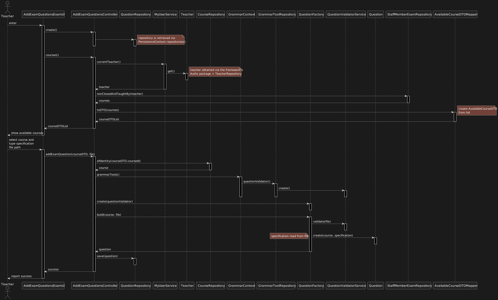

US 2007 -- Add/Update Exam Questions to a Repository
====================================================

# Analysis
## Client Specifications

From the project description:

>   The solution should be based on the following type of questions that are
> inspired on the Moodle platform.
>   You should support, as much as possible, the features that are supported in Moodle (...)

The **ANTLR** tool should be used to design the specification grammar
## Business rules

<!-- TODO?? -->

## Unit Tests
### Question

1. ensureMustHaveCourse
2. ensureMustHaveSpecification
3. ensureSpecificationCannotBeNull
4. ensureSpecificationCannotBeEmpty
### Per question type
#### Matching
1. ensureMatchingMustHaveSolution
#### Multiple Choice

1. ensureMultipleChoiceMustHaveDescription
2. ensureMultipleChoiceMustHaveAnswer() {

#### Short Answer
1. ensureShortAnswerMustSpecifyCaseSensitivity
#### Numerical
1. ensureNumericalMustHaveSolution

#### Missing Words
1. ensureMissingWordsMustSpecifyGroup
#### True/False
1. ensureTrueFalseMustHaveSolution

# Design

Even though the client has specified that the **ANTLR** should be used,
since this is essentially a service exterior to our domain, code that
interacts with the ANTLR/grammar components must **protected from future variations**.

Therefore, a mechanism similar to that of the persistence layer should be implemented:

- Creation of a **GrammarContext** class that handles the **GrammarToolsFactory**
- Implementation of a grammar validator for formative exams/regular exams/questions
for each of the supported backends (currently only ANTLR)
- Dynamic loading of the appropriate classes using the Java Reflections API®.

- Use a layer based approach
- Domain classes:
    + **Question**
    + **QuestionSpecification**
    + **QuestionFactory**
- Controller:
    + **AddExamQuestionsController**
- Grammar:
    + **QuestionValidatorService**
- Repository:
    + **QuestionRepository**
    + **StaffMemberRepository**
    + **CourseRepository**

The teacher adding questions **must** select a course they teach in; in order to
decrease the coupling between UI and Domain, **DTO** objects will be used to report to the UI.

Since the grammar for the questions' specification is external to the domain
a **Service** will be created in order to verify that specifications input by users
comply with the aforementioned grammar.

In order to ensure that questions are **always** created with a valid specification,
a **Factory** class will be used to abstract the process.

> **Note**: Constructors for Question and QuestionSpecification will have **protected** visibility.

## Sequence diagram

The following [sequence diagram](./sd.svg) was created to answer this Use Case:

