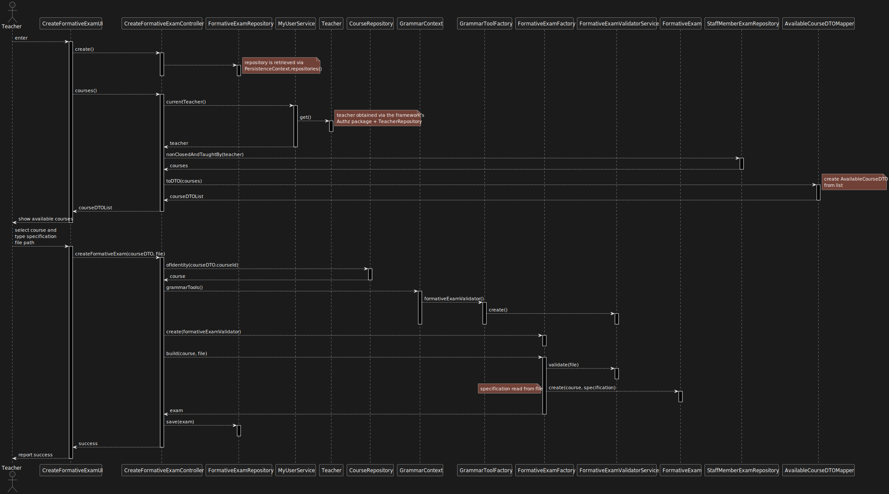

US 2008 -- Create/Update Automatic Formative Exams
==================================================

# Analysis
## Client Specifications

- The formative exam specification is similar to regular exams
    + **Title**
    + **Header**
        * textual *description*
        * *feedback* and *grading* are **only** provided at the end.
    + **Sequence of sections**
        * formative exams are composed of **one or more** sections
        * each section *may* have a textual description to appear at the beginning
        * each section has **one or more** questions
    + **No start/end dates**
- When creating the exam specification, the user specifies the **type**
of questions to be inserted.

The **ANTLR** tool should be used to design the specification grammar
## Business rules

- Teacher can only create formative exams for courses they're part of.
- The **system** should generate the formative exam based on the specification.
- The **system** should randomly create the questions based on the type.
- Questions **may not** repeat within a formative exam.

> **Note**: "the system should randomly create the questions (...)" is being understood as the
system using the existing question repository to fill in questions based on their type.

## Unit Tests

### Formative Exam

1. ensureMustHaveCourse
2. ensureMustHaveSpecification

### Formative Exam Specification

1. ensureSpecificationCannotBeNull
2. ensureSpecificationCannotBeEmpty
3. ensureSpecificationMustHaveTitle
3. ensureSpecificationMustHaveAtLeastOneSection
4. ensureSpecificationSectionsMustHaveAtLeastOneQuestionType
5. ensureSpecificationDescriptionCanBeOptional
6. ensureInvalidQuestionTypesAreNotAllowed

# Design

Even though the client has specified that the **ANTLR** should be used,
since this is essentially a service exterior to our domain, code that
interacts with the ANTLR/grammar components must **protected from future variations**.

Therefore, a mechanism similar to that of the persistence layer should be implemented:

- Creation of a **GrammarContext** class that handles the **GrammarToolsFactory**
- Implementation of a grammar validator for formative exams/regular exams/questions
for each of the supported backends (currently only ANTLR)
- Dynamic loading of the appropriate classes using the Java Reflections API®.

- Use a layer based approach
- Domain classes:
    + **FormativeExam**
    + **FormativeExamSpecification**
    + **FormativeExamFactory**
- Controller:
    + **CreateFormativeExamController**
- Grammar:
    + **FormativeExamValidatorService**
- Repository:
    + **FormativeExamRepository**
    + **TeacherRepository**
    + **StaffMemberRepository**
    + **CourseRepository**

The teacher creating the formative exam **must** select a course they teach in; in order to
decrease the coupling between UI and Domain, **DTO** objects will be used to report to the UI.

Since the grammar for the exam specification is external to the domain
a **Service** will be created in order to verify that specifications input by users
comply with the aforementioned grammar.

In order to ensure that formative exams are **always** created with a valid specification,
a **Factory** class will be used to abstract the process.

**NOTE:** Constructors for FormativeExam and FormativeExamSpecification
will have **protected** visibility.

## Sequence diagram

The following [sequence diagram](./sd.svg) was created to answer this Use Case:

## Grammar

Refer to [the following document](./grammar-reference.md) for information on the formative exam grammar.
<!-- # Test Plan -->
