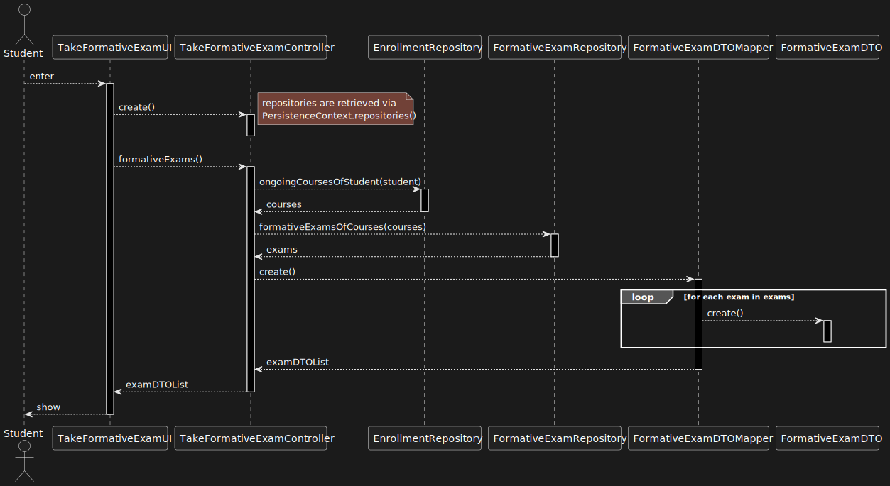
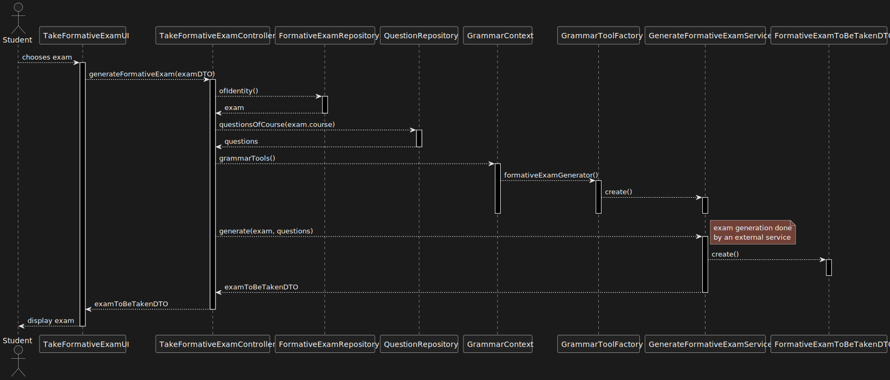
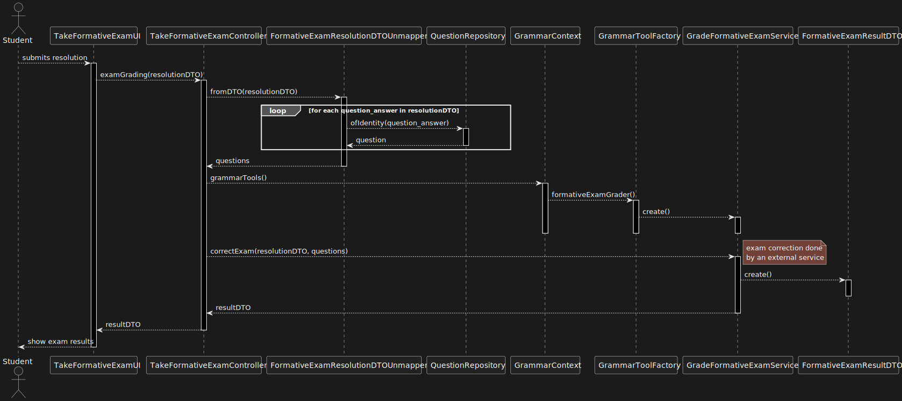
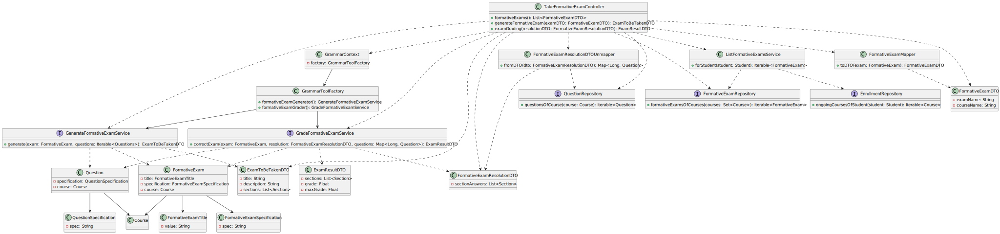

# US 2009 | Student - Take an automatic formative exam

## 1. Analysis

A student is presented with an (formative) exam and they answer its questions.

The generation of formative exams should be done **automatically** by the system,
taking advantage of the *questions* added to the **repository of exam questions**
(US 2007).

The system must also ensure questions **do not repeat** --- i.e appear more than
once --- on the generated formative exam.

At the end, the system must display the **feedback** and the **result** (i.e the grade)
of the exam.

Grading and feedback should be **automatically computed** by a **parser** based on
the grammar defined for the exam's structure.

## 2. Requirements

This use case is based on the following requirements:

- **R1.** The student must be able to see a list of formative exams they can take.
- **R2.** The student must be able to take a formative exam.
- **R3.** The student must be able to see their grade and feedback on their performance, for each question.

### 2.1. Questions, Answers and Interpretations

1. From [ALVES: US 2004/2009](https://moodle.isep.ipp.pt/mod/forum/discuss.php?d=23236#p29396)

> > (...) Second we would like for you to clarify the expected flow
> > of both feedback and grade types.
>
> (...) So, the grade and the feedback should be provided only and the end of the exam.
> At the end of the exam, the system should display to the student the resulting grade
> of the exam as well as the grade and feedback for each question/answer.

**Interpretation:** When analyzing the initial user story requirement, it was
assumed that "result of the exam" meant "the final grade"; however, this answer
states that the resulting grade for **each** question should also be displayed.

2. From [RENTE: US2006 - Listar notas](https://moodle.isep.ipp.pt/mod/forum/discuss.php?d=23438#p29652)
> > As notas dos exames formativos tambem deveriam ser listadas?
> > Ou apenas seriam listadas as notas dos exames "normais"
>
> Os exames formativos são gerados automaticamente e, não existindo um
> registo das perguntas e respostas desses exames, não penso que faça sentido
> armazenar os resultados dessas notas.
> No entanto, o sistema deve apresentar para estes exames o feedback e a nota no final.

**Interpretation:** Unlike "regular" exams, grades from taking formative exams
are not stored anywhere on the system. They are; however, displayed when the
student finishes taking the exam

3. From [RENTE: US_2004/2009](https://moodle.isep.ipp.pt/mod/forum/discuss.php?d=23245#p29711)

> > Na sua resposta referiu:
> > > (...) Mas a sua implementação não necessita de ser realizada em HTML (ou seja, não é esperado que o façam).

> > Quer isto dizer que, se a equipa de desenvolvimento tal pretender
> > poderá optar por implementar a componente resolver o exame em HTML (página web)?
> >
> > Obiviamente que o aspeto "The feedback and grade of the exam should be automatically
> > calculated by a parser based on the grammar defined for exams structure.",
> > referido na descrição da user story, seria implementado utilizado o "backend" java
> > que tem sido desenvolvido até ao momento; portanto, a minha pergunta refere-se unicamente
> > ao aspeto relacionado com a apresentação/interação com o utilizador.
>
> Não é bem isso que o cliente pretende. O que o cliente pretende é que essa
> funcionalidade seja executada numa aplicação consola
> (com a particularidade de usarem na solução a linguagem de programação Java e o ANTLR).
> Se "fugirmos" destes requisitos de implementação podemos estar a levantar problemas aos
> objetivos de aprendizagem de duas unidades curriculares: EAPLI e LPROG.
> Assim, a minha resposta à sua pergunta é, em principio, não fazerem em HTML
> (até porque não sei bem o que seria isso de fazerem em HTML, existem muitas opções,
> nem sei bem o que é o vosso "backend" actual).
> No entanto, penso que será algo que podem discutir com os docentes de EAPLI e LPROG.
>
> A minha resposta negativa é por principio, pois parece-me que isso irá trazer muitas
> novas questões. Mas esta é, essencialmente, uma questão técnica,pelo que,
> se quiser prosseguir com essa ideia, sugiro uma consulta dos docentes de EAPLI e LPROG.

**Interpretation:** We can go forth with the web UI, so long as we get permission from
the involved teachers ("docentes").

## 3. Design

This use case is very similar to [US 2004](../us_2004/README.md), meaning much of
what was described in that US's analysis/design applies to this US as well.

Some of the major implementation differences:

- formative exams are generated based on questions from the questions' repository
- formative exams have **do not** have **start** or **end dates**.
- feedback/grades are **only** provided **at the end** of the exam

### 3.1. Realization

This use case was broken down into three parts:

1. Provide the student with a list of exams they can currently take.

](./1-list-fexams.svg)

2. Generate the exam from the stored specification and provide it to the user.

](./2-fexam-to-be-taken.svg)

3. Compute the student's grade and per-question feedback.

](./3-grade-fexam.svg)

### 3.2. Classes

](./cd.svg)

### 3.3. Applied Patterns

- **Dependency Inversion and Protected Variations:**
    + The usage of **dependency inversion** and **protected variations** are crucial to
      reduce future maintainability issues/technical debt in case the **ANTLR** dependency
      is swapped out for another alternative

- System components that interact with the grammar context will do so via an interface that
each grammar implementation (*currently only ANTLR is supported*) needs to adhere to.

- **DTO** objects will be used to ensure intermediate system layers need not be
altered if there is a change in requirements/tooling to use.

### 3.4. Tests

In order to accurately test this functionality, we need to interact
with the Aggregate Root repositories, meaning **unit tests aren't the best approach here**.

Instead, integration tests should be performed.

## 4. Integration/Demonstration

In order to execute this use case, the user should first have at their disposal a
formative exam specification file, as well as a repository of questions, also in the
form of a file.

It should be in accordance with the formative exam grammar specification, more information
on which can be found in the [Formative Exam Specification Manual](../us_2008/grammar-reference.md).

After having the exam specification file, the user should then
**run and login to the system as a student**.

They should then navigate to the "Formative Exams" page, where it will be presented an
option to take an exam. A website will then open, where the user can **select and do the exam**.

Grading will be done automatically, and the user will be presented with their grade
and feedback for each question after they submit their exam.

## 5. Observations

This use case was successfully implemented, and **all the requirements were met**.

Even though the client did not specify that the formative exam should be done
in a web browser, they authorized us to do so, as long as the other interested parties
also approved.

Since we got approval, we then decided to opt for the web interface, as it is
more **user-friendly** and, as a team, we believe it is the most appropriate for this use case.
