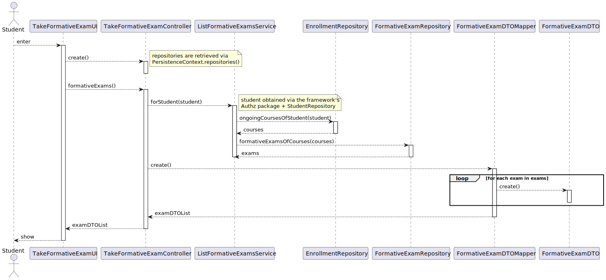
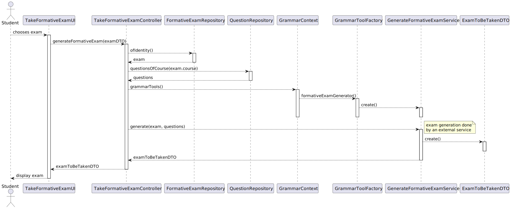
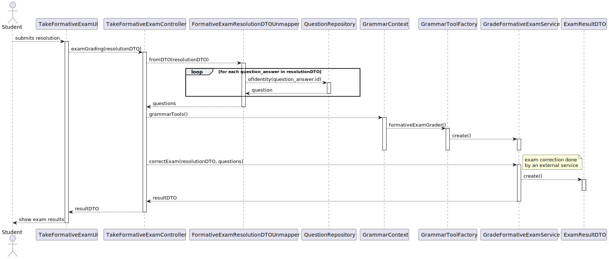

US 2009 --- As Student, I want to take an automatic formative exam
==================================================================
# Analysis

A student is presented with an (formative) exam and they answer its questions.

The generation of formative exams should be done **automatically** by the system,
taking advantage of the *questions* added to the **repository of exam questions**
(US 2007).

The system must also ensure questions **do not repeat** --- i.e appear more than
once --- on the generated formative exam.

At the end, the system must display the **feedback** and the **result** (i.e the grade)
of the exam.

Grading and feedback should be **automatically computed** by a **parser** based on
the grammar defined for the exam's structure.

## Relevant Forum Questions and Answers

1. From [ALVES: US 2004/2009](https://moodle.isep.ipp.pt/mod/forum/discuss.php?d=23236#p29396)
> > (...) Second we would like for you to clarify the expected flow
    of both feedback and grade types.
>
> (...) So, the grade and the feedback should be provided only and the end of the exam.
  At the end of the exam, the system should display to the student the resulting grade
  of the exam as well as the grade and feedback for each question/answer.

**Interpretation:** When analyzing the initial user story requirement, it was
assumed that "result of the exam" meant "the final grade"; however, this answer
states that the resulting grade for **each** question should also be displayed.

2. From [RENTE: US2006 - Listar notas](https://moodle.isep.ipp.pt/mod/forum/discuss.php?d=23438#p29652)
> > As notas dos exames formativos tambem deveriam ser listadas?
    Ou apenas seriam listadas as notas dos exames "normais"
>
> Os exames formativos são gerados automaticamente e, não existindo um
  registo das perguntas e respostas desses exames, não penso que faça sentido
  armazenar os resultados dessas notas.
> No entanto, o sistema deve apresentar para estes exames o feedback e a nota no final.

**Interpretation:** Unlike "regular" exams, grades from taking formative exams
are not stored anywhere on the system. They are; however, displayed when the
student finishes taking the exam

## Business rules

- A formative exam can only be generated if there are enough questions
  to fulfill its specification.

## Testing

1. ensureNumberOfQuestionsFulfillsSpecification

# Design

This use case is very similar to [US 2004](../us_2004/README.md), meaning much of
what was described in that US's analysis/design applies to this US as well.

Namely, the usage of **dependency inversion** and **protected variations** are
crucial to reduce future maintainability issues/technical debt in case the
**ANTLR** dependency is swapped out for another alternative:

- **DTO** objects will be used to ensure intermediate system layers need not be
  altered if there is a change in requirements/tooling to use.
- System components that interact with the grammar context will do so via an
  interface that each grammar implementation (*currently only ANTLR is supported*)
  needs to adhere to.

Some of the major implementation differences:

- formative exams are generated based on questions from the questions' repository
- formative exams have **do not** have **start** or **end dates**.
- feedback/grades are **only** provided **at the end** of the exam

## Classes
- Domain:
    + **FormativeExam**
    + **Course**
    + **Student**
- Controller:
    + **TakeFormativeExamController**
- Grammar:
    + **GenerateFormativeExamService**
    + **GradeFormativeExamService**
- Repository:
    + **FormativeExamRepository**
    + **QuestionRepository**
- DTO:
    + **FormativeExamDTO**
    + **FormativeExamDTOMapper**

    + **FormativeExamToBeTakenDTO**

    <!-- TODO: investigate if ExamResultDTO can be re-used -->
    + **FormativeExamResultDTO**
    + **FormativeExamResultDTOMapper**

## Sequence diagram
This use case was broken down into three parts:

1. Provide the student with a list of exams they can currently take.

](./1-list-fexams.svg)

2. Generate the exam from the stored specification and provide it to the user.

](./2-fexam-to-be-taken.svg)

3. Compute the student's grade and per-question feedback.

](./3-grade-fexam.svg)
