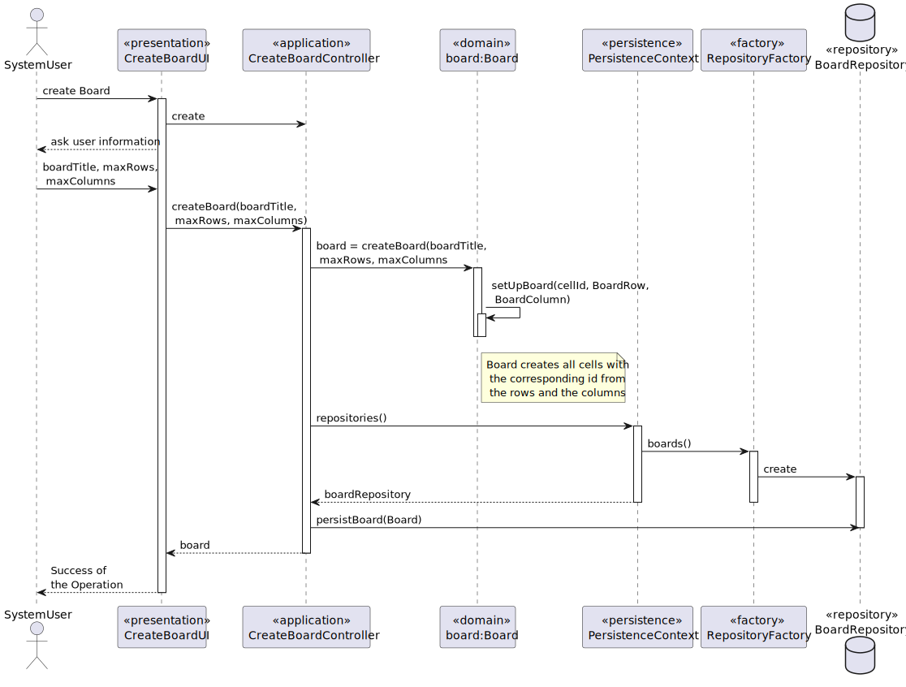

US 3002 -- Create a Board
==============================

# Analysis

## Business rules

- A board have a limited number of rows and columns
- Any board can have 3 states, Creates, Shared and Archived

## Unit tests

1. ensureCellCreation
2. ensureSetBoardRowId
3. ensureSetBoardColumnId
4. ensureGetRow
5. ensureGetColumn
6. ensureRowIdsAreAdded
7. ensureColumnsIdsAreAdded
8. ensurePostItCreation
9. ensurePostItCanAlterCell
10. ensurePostItCanBeMoved
11. ensureArchiveBoardState
12. ensureShareBoardState
13. ensureCreateBoardState
14. ensureSameAsVerify
15. ensureBoardSameName
16. ensureIdentity
17. ensureToString
18. ensureGetBoardColumnId
19. ensureGetBoardColumnTitle
20. ensureSetBoardColumnTitle
21. ensureColumnHashCode
22. ensureGetBoardRowId
23. ensureGetBoardRowTitle
24. ensureSetBoardRowTitle
25. ensureRowHashCode
26. ensureGetBoardTitle
27. ensureSetBoardTitle
28. ensureTitleHashCode
29. ensureCompareBoardTitle
30. ensureCellHashCode
31. ensurePostItHashCode

# Design

The Creation of a board has a limit of rows and columns 20 and 10 respectively.

for boards to be made according to the domain and Business rules presented,  in the creation of a
board are also created all the cells corresponding and the rows and columns.

All boards when created have the `CREATED` state assigned.

## Classes

- Domain:
    + **Board**
    + **BoardTitle**
    + **BoardColumn**
    + **BoardRow**
    + **BoardState**
    + **Cell**
    + **PostIt**
- Controller:
    + **CreateBoardController**
- Repository:
    + **BoardRepository**

## Sequence Diagram

