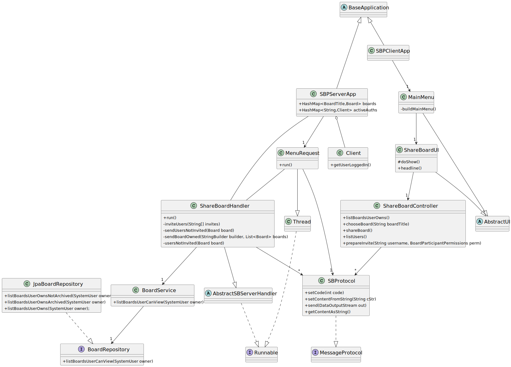
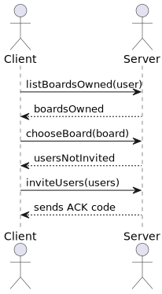
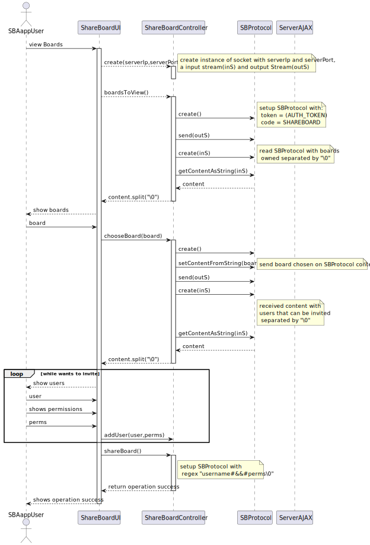
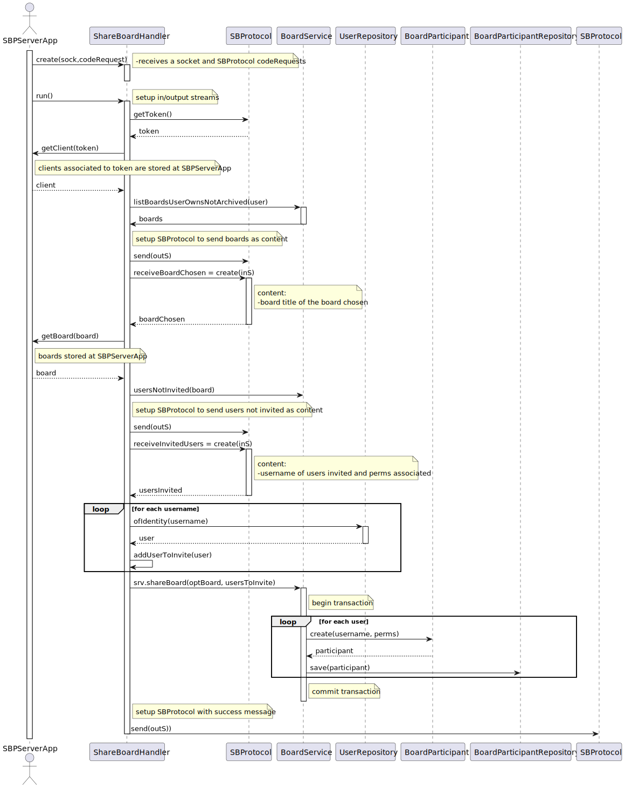

US 3004 -- As User, I want to share a board
=========================================================

## 1. Context

**It is the first time the task is assigned to be developed**

## 2. Requirements

*In this section you should present the functionality that is being developed, how do you understand it, as well as
possible correlations to other requirements (i.e., dependencies).*

**US 3005** As User, I want to view, in real-time, the updates in the shared boards

- Only users with view permissions can use this functionality

  > Q: O cliente pretende que seja apenas desenvolvida uma página web para a visualização das boards e autenticação na
  linha de comandos(cli), como demonstrado na página 11 da especificação do projeto, ou então também, aceitaria uma
  aplicação totalmente desenvolvida numa página web (com autenticação executada na mesma)

  > A:Como cliente, e se percebi bem, a primeira opção será o que eu pretendo. Ou seja, todas as funcionalidades da
  Shared
  board App são realizadas na aplicação do tipo "consola" em java com a exceção da parte relativa
  à visualização em tempo real dos boards.

*Regarding this requirement we understand that it relates to...*

- Board must be shown in the user's browser and changes that are made to this board must be shown in real time without
  user interaction

## 3. Analysis

This functionality has to follow specific business rules for it to work
as intended, those business rules are:

- User logged can only add participants to a board that he/she owns.
- The participants invited have to be system users.

For deeper understand on the analysis made relating client-server model
check [the following document](../SBServer/Analysis.md)

## 4. Design

# Design

**SharedBoardService**
The ShareBoardService class is a key component of the application's server-side logic for sharing and managing boards.
This class facilitates the sharing of boards with other system users, manages board ownership and participation, and
provides various methods for retrieving board information based on user permissions.

    listBoardsUserOwns(SystemUser user):
    This method retrieves a list of boards owned by a specific user. It calls the boardRepository to fetch the boards associated with the given user. The method returns a list of Board objects.

    shareBoard(Board board, List<Pair<SystemUser, BoardParticipantPermissions>> users):
    The shareBoard method enables the sharing of a board with multiple users. It takes a Board object and a list of pairs, 
    each containing a SystemUser and corresponding BoardParticipantPermissions. For each pair, it creates a new
    BoardParticipant object and saves it using the boardParticipantRepository.

    getBoardsByParticipant(SystemUser user):
    This method retrieves a list of boards in which the specified user is a participant. It utilizes the boardParticipantRepository to fetch the relevant boards.

    usersNotInvited(Board board):
    Given a board, this method returns a list of users who have not been invited to participate in that board. It retrieves all system users using the userRepository and removes those who are already participants in the specified board.

In order easily communicate between SBServer and SBApp it was used the following grammars on the SBProtocol content:

- **to list board/users**: char '\0' between each of the elements
  ex: **board1**\0**board2**\0**board3**\0
- **invite participants**: char '\0' between each fo the invites, and "#&&#" between username and permissions

  > marco1#&&#READ\0mary#&&#WRITE\0

The previous example will be parsed into 2 BoardParticipants:

- username: marco1 Permissions: READ
- username: mary Permissions: WRITE

**For a better understand on the design behind the client-server model
check [the following document](../SBServer/Design.md)**

### 4.1 Class diagram

### 4.2 Unit Tests

    @Test
    public void participantWithReadPermissions() {
        SystemUserBuilder userBuilder = new SystemUserBuilder(new NilPasswordPolicy(), new PlainTextEncoder());
        SystemUser participant = userBuilder.with("Participant", "Password1", "Dummy", "Dummy", "participan@gmail.com")
                .withRoles(BaseRoles.MANAGER).build();
        BoardParticipant p = new BoardParticipant(board, participant, BoardParticipantPermissions.READ);
        assertFalse(p.hasWritePermissions());
        assertEquals(BoardParticipantPermissions.READ, p.permission());
    }

    @Test
    public void participantWithWritePermissions() {
        SystemUserBuilder userBuilder = new SystemUserBuilder(new NilPasswordPolicy(), new PlainTextEncoder());
        SystemUser participant = userBuilder.with("Participant", "Password1", "Dummy", "Dummy", "participan@gmail.com")
                .withRoles(BaseRoles.MANAGER).build();
        BoardParticipant p = new BoardParticipant(board, participant, BoardParticipantPermissions.WRITE);
        assertTrue(p.hasWritePermissions());
        assertEquals(BoardParticipantPermissions.WRITE, p.permission());
    }

**Integration tests should be performed in order to better improve this functionality**

### 4.3. Applied Patterns

Builder Pattern:

    In the ShareBoardHandler class, the StringBuilder is used to construct strings, specifically 
    for sending responses to the client. The StringBuilder follows the Builder pattern, allowing the incremental construction of complex strings efficiently.

Repository Pattern:

    The ShareBoardService class utilizes the Repository pattern by interacting with repositories such as BoardRepository,
    BoardParticipantRepository, and UserRepository. These repositories abstract the data access and provide a consistent 
    interface for retrieving and persisting data related to boards, participants, and users.

### 4.4 Sequence diagram

In order to better understand this US has 2 components (client and server) that can be better described if divided.
The following SSD describes better the communication between this client-server model

Client-Server:

Client SD:

Server SD:

## 5. Implementation

*In this section the team will present, important artifacts necessary to fully understand the implementation like
fetching data operations*

## 6. Integration/Demonstration

The user can only use this functionality after creating a board 

## 7. Observations

No observations

