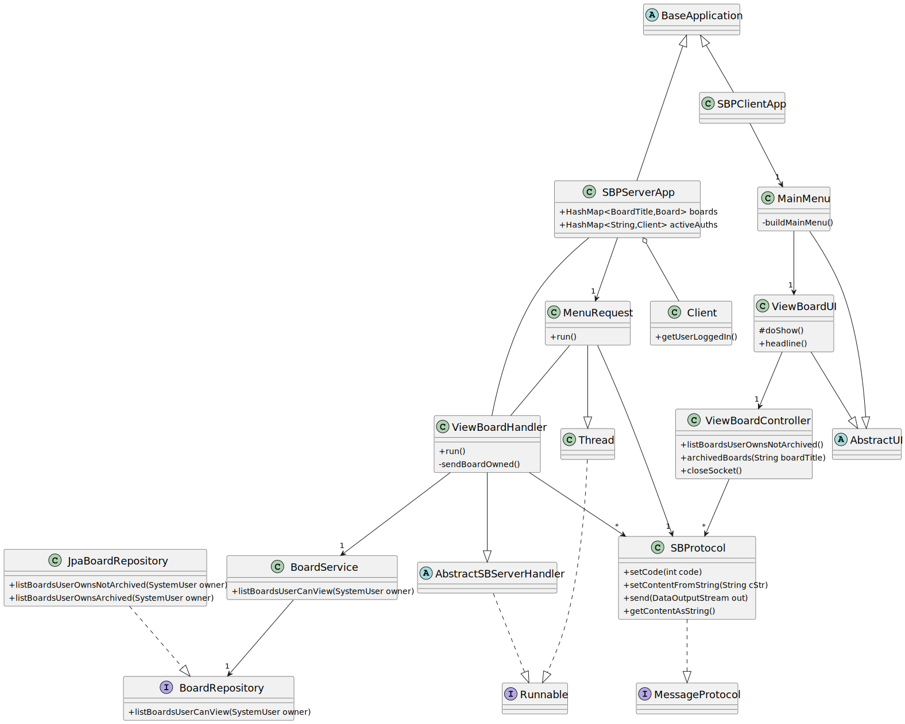
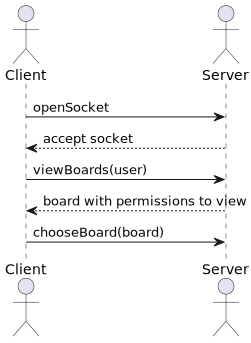
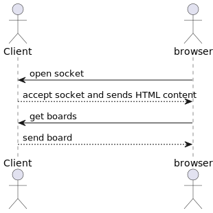
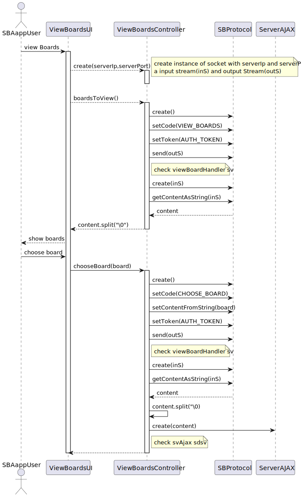
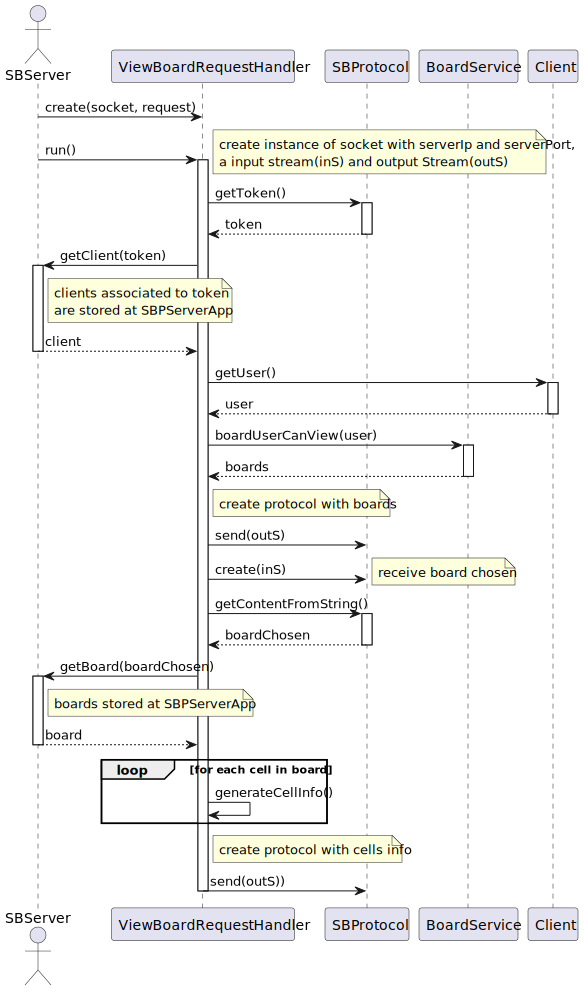

#US 3005 -- View Board changes in real time
==================================================

## 1. Context

**It is the first time the task is assigned to be developed**

## 2. Requirements

*In this section you should present the functionality that is being developed, how do you understand it, as well as
possible correlations to other requirements (i.e., dependencies).*

**US 3005** As User, I want to view, in real-time, the updates in the shared boards

- Only users with view permissions can use this functionality

  > Q: O cliente pretende que seja apenas desenvolvida uma página web para a visualização das boards e autenticação na
  linha de comandos(cli), como demonstrado na página 11 da especificação do projeto, ou então também, aceitaria uma
  aplicação totalmente desenvolvida numa página web (com autenticação executada na mesma)

  > A:Como cliente, e se percebi bem, a primeira opção será o que eu pretendo. Ou seja, todas as funcionalidades da
  Shared
  board App são realizadas na aplicação do tipo "consola" em java com a exceção da parte relativa
  à visualização em tempo real dos boards.

*Regarding this requirement we understand that it relates to...*

- Board must be shown in the user's browser and changes that are made to this board must be shown in real time without
  user interaction

## 3. Analysis

- Only must be shown boards shared to the user, or boards owned
- The board must be available in a browser to the user
- When viewing the board, it is expected that new changes are done in real-time(user must no need to refresh page)

For deeper understand on the analysis made relating client-server model
check [the following document](../SBServer/Analysis.md)

## 4. Design

In order to implement real-time it will be used a TCP connection between the SBApp and the web browser
using HTTP to present the information relating the boards and AJAX to fetch new changes done by other users

Once added to the subscribers list, clients become part of a dynamic network that actively receives notifications about
changes made to the board they are viewing. This ensures that they are always up-to-date with the latest changes.

- The properly use of threads can improve the optimization of this feature, consequently preventing problems when
  escalating the app usage since end users using the SBApp wont wait for the others end user to receive the updates

**For a better understand on the design behind the client-server model
check [the following document](../SBServer/Design.md)**

### 4.1 Class diagram

### 4.2 Unit Tests

Integration tests should be performed in order to better improve this functionality

### 4.3. Applied Patterns

**Observer Pattern**

To ensure the smooth functioning of this client-side feature, it is necessary to implement a mechanism that can notify
the subscribers (users viewing the board) whenever a new change is made. This can be achieved using the observer
pattern, which involves an **NewChangeEvent** and an **NewChangeWatchDog**.

The event stores the relevant data required for publishing the event. It is crucial to include at least the following
information:

**Board**: to determine which users should be notified.
**SBProtocol message**: to be sent to the SBApp.
The event handler utilizes the information from the event to iterate through all the users subscribed to the board and
sends the SBProtocol message, containing the details of the specific change, through Berkeley sockets.

When viewing a board, the SBServer acts as a middleman, receiving and propagating the SBProtocol message to the users.
However, the AJAX requests and HTML parsing necessary for displaying the board are handled by the SBApp. This separation
of responsibilities ensures efficient handling of data and user interface rendering, allowing for a more streamlined and
scalable architecture.

### 4.4 Sequence diagram

In order to better understand this US has 2 components (client and server) that can be better described if divided.
The following SSD describes better the communication between this client-server model

Client-Server:

Client-Browser:

Client SD:

Server SD:

## 5. Implementation

*In this section the team will present, important artifacts necessary to fully understand the implementation like fetching data operations*

## 6. Integration/Demonstration

In order to use this functionality the user must have read permissions in a given board:

## 7. Observations

No observations 