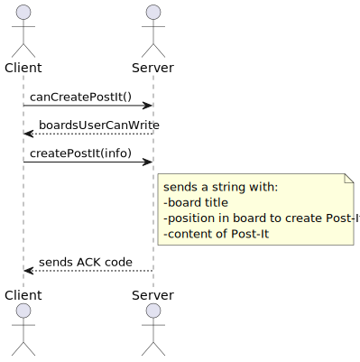
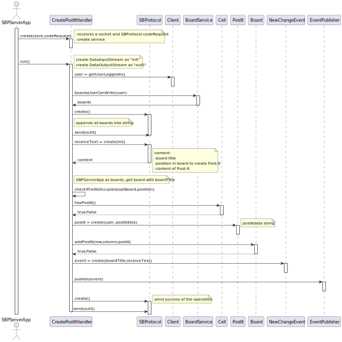

# US 3006

## 1. Context

*As User, I want to create a post-it on a board*

## 2. Requirements

*The main objective of this user story is to create a post-it on a board, this user story as correlation with the following US's:*

**US 3002** As {User} I Want to create a board

- First we need a board to be created before we can create a post-it on a board

**US 3004** As {User}, I want to share a board

- Although this user story it's not entirely correlated with the user story being developed , it wouldn't make sense to create a post-it on a board that wasn't shared yet.

**US 3005** As {User} I want to view, in real-time, the updates in the shared boards

- Although this user story it's not entirely correlated with the user story being developed , 
    the backbone of the HTTP server for the client app was developed in this user story and we need that to develop the US3006. 

  
## 3. Analysis

This functionality has to follow specific business rules for it to work as intended, those business rules are regarding
the following topics:

**1º** A post-it can be a text or image.

1. From [DIAS: Conteudo dos Post-it's](https://moodle.isep.ipp.pt/mod/forum/discuss.php?d=23398)
> >  Boa tarde caro cliente,
Nas especificações do sistema é dito o seguinte:
"Users with write permission may post content to a cell in the board. The content can be a text or an image."
Quando um User cria um post-it deve passar um link da imagem por exemplo:
"https://www.isep.ipp.pt/img/logo_20230106.png"
Ou devemos anexar uma imagem que está no nosso computador?
>
> Boa tarde.
Para o cliente é um pouco indiferente o mecanismo que usam para fazer o "post" de imagens (assim como o(s) formato(s) suportado(s)).
Podem optar pela solução que for mais simples. Suponho que suportar o "upload" de imagens locais e suportar um formato comum, como png ou jpeg, seja suficiente.

**2º** Participants of a board have "Write" or "Read" permissions , only participants of the board with "Write" permissions can create a post-it.

## 4. Design

To better answer this problem a service named **BoardService** will be used, the methods needed from that service is:

- `boardsUserCanWrite(user)`

This method will perform the needed database search operations in order to find the boards that the user participates and has **WRITE** permissions.

After this operation the user will choose a Board to create a post-it on, some information will be asked the user to insert:

- Cell to create the post-it on(number of row and number of column).
- Text or image.

After all information is inserted by the user the following operation will be done:

In SBPServerApp we will have a map of **Board** , this was used to reduce the access to database in runtime.
We search for the board intended and after verify if the **Cell** we want to add the post-it is empty, we
create **Post-it** and add it to the cell on board.

In the end a new event it's added to **NewChangeEvent**, the event stores the relevant data required for publishing the event. 
It is crucial to include at least the following information:

- Board: to determine which users should be notified. 
- SBProtocol message: to be sent to the SBApp. The event handler utilizes the information from the event to iterate 
through all the users subscribed to the board and sends the SBProtocol message, containing the details of the specific change.

### 4.1. Realization

### 4.2. Class Diagram

### 4.2.1 System Sequence Diagram(SSD)

### 4.2.2 Sequence Diagram Client

### 4.2.2 Sequence Diagram Server

### 4.3. Applied Patterns

- **Factory** - Responsible for creating complex objects or aggregates while encapsulating the creation logic.
- **Repository** - Provides a way to retrieve and persist aggregates.
    + **BoardParticipantRepository**
- **Observer Pattern** -To ensure the smooth functioning of this client-side feature, it is necessary to implement a mechanism that can notify
  the subscribers (users viewing the board) whenever a new change is made. This can be achieved using the observer
  pattern, which involves an **NewChangeEvent** and an **NewChangeWatchDog**.

### 4.4. Tests

In order to accurately test this functionality, we need to interact with the Aggregate Root repositories and 
with the server and client apps, meaning unit tests aren't the best approach here

Instead, integration tests should be performed.

## 5. Implementation

*In this section the team will present, important artifacts necessary to fully understand the implementation of this user story*

 **JpaBoardParticipantRepository**

    @Override
    public Iterable<Board> withPermission(SystemUser user, BoardParticipantPermissions perm) {
        final var query = entityManager().createQuery(
                "SELECT bp.board FROM BoardParticipant bp " +
                        "WHERE bp.participant = :user" +
                        " AND bp.permission = :perm",
                Board.class);
        query.setParameter("user", user);
        query.setParameter("perm", perm);
        return query.getResultList();
    }

 **CreatePostItHandler**

    private boolean checkIfCellIsOccupied(Board board, String alterPosition) {
        String[] dimensions = alterPosition.split(",");
        int row = Integer.parseInt(dimensions[0]);
        int col = Integer.parseInt(dimensions[1]);
        Cell cell = board.getCell(row,col);
        return cell.hasPostIt();
    }

## 6. Integration/Demonstration

* A new option on the client App menu options was added.
* For demo purposes some tasks are bootstrapped while system starts, like boards .

## 7. Observations

Nothing to add here.