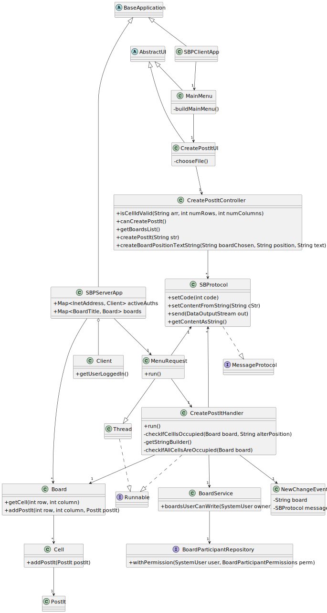
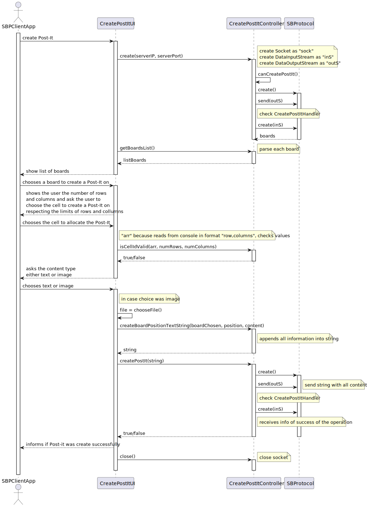

# US 3006

## 1. Context

*As User, I want to create a post-it on a board*

## 2. Requirements

*The main objective of this user story is to create a post-it on a board, this user story as correlation with the following US's:*

**US 3002** As {User} I Want to create a board

- First we need a board to be created before we can create a post-it on a board

**US 3004** As {User}, I want to share a board

- Although this user story it's not entirely correlated with the user story being developed , it wouldn't make sense to create a post-it on a board that wasn't shared yet.

**US 3005** As {User} I want to view, in real-time, the updates in the shared boards

- Although this user story it's not entirely correlated with the user story being developed , 
    the backbone of the HTTP server for the client app was developed in this user story and we need that to develop the US3006. 

  
## 3. Analysis

This functionality has to follow specific business rules for it to work as intended, those business rules are regarding
the following topics:

**1º** A post-it can be a text or image.

1. From [DIAS: Conteudo dos Post-it's](https://moodle.isep.ipp.pt/mod/forum/discuss.php?d=23398)
> >  Boa tarde caro cliente,
Nas especificações do sistema é dito o seguinte:
"Users with write permission may post content to a cell in the board. The content can be a text or an image."
Quando um User cria um post-it deve passar um link da imagem por exemplo:
"https://www.isep.ipp.pt/img/logo_20230106.png"
Ou devemos anexar uma imagem que está no nosso computador?
>
> Boa tarde.
Para o cliente é um pouco indiferente o mecanismo que usam para fazer o "post" de imagens (assim como o(s) formato(s) suportado(s)).
Podem optar pela solução que for mais simples. Suponho que suportar o "upload" de imagens locais e suportar um formato comum, como png ou jpeg, seja suficiente.

**2º** Participants of a board have "Write" or "Read" permissions , only participants of the board with "Write" permissions can create a post-it.

**3º** The owner of the post-it can delete it.
AQUI----------------------------------------------------------

## 4. Design

### 4.1. Realization

### 4.2. Class Diagram

### 4.2.1 System Sequence Diagram(SSD)

### 4.2.2 Sequence Diagram Client

### 4.2.2 Sequence Diagram Server

### 4.3. Applied Patterns

### 4.4. Tests

In order to accurately test this functionality, we need to interact with the Aggregate Root repositories, meaning unit tests aren't the best approach here.

Instead, integration tests should be performed.

## 5. Implementation

*In this section the team will present, important artifacts necessary to fully understand the implementation like the database operations*

 

## 6. Integration/Demonstration

* A new option on the client App menu options was added.
* For demo purposes some tasks are bootstrapped while system starts, like boards .

## 7. Observations

Nothing to add here.