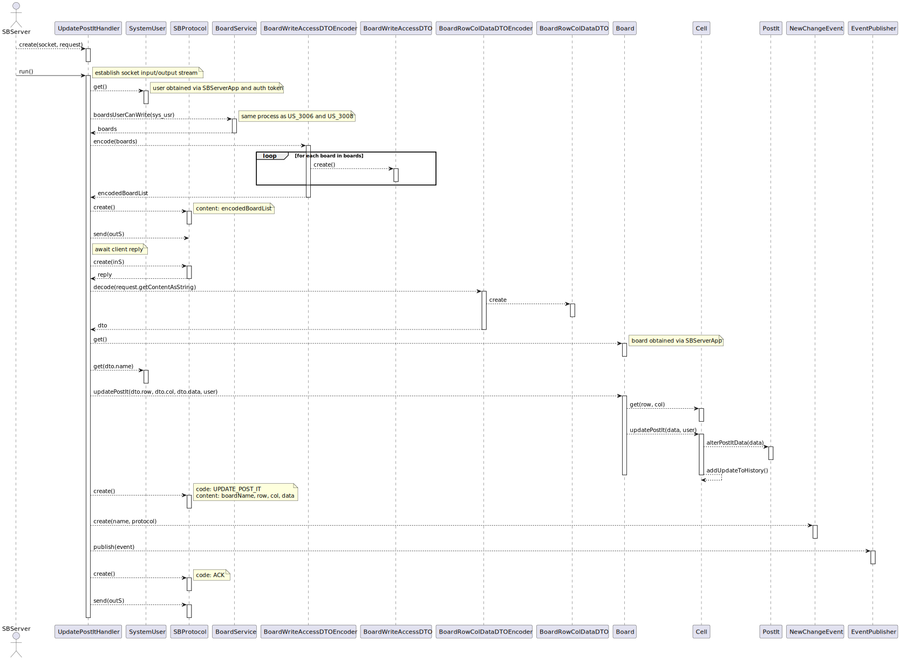

# US 3007 - Update a post-it

## 1. Context

**As User, I want to change a post-it**

## 2. Requirements

From the project specification:

> Users with **write** permission may **post content** to a cell in the board

> When the server commits a post it also should **notify all clients with access** to the board of the **update**

### 2.1. Questions and Answers

2. From [RENTE: US3007 - Atualizar o conteudo de uma celula](https://moodle.isep.ipp.pt/mod/forum/discuss.php?d=23734)

> > Perante a US3007, o cliente pretende que seja disponibilizada a função de alterar o conteúdo de uma célula, 
> > a função de trocar o conteúdo de uma célula com o conteúdo de outra ou, ambas as opções?
>
> Estamos próximos da data de entrega do sprint C, pelo que é de evitar "acrescentar" informação adicional 
> ao que está disponível na especificação. Assim remeto para o seguinte texto da especificação: 
> "The user who created a post in a cell can change that post. It may change its contents or move the post into a 
> free cell. "

## 3. Analysis

This type of functionality can be a source of severe synchronization problems, as
several board participants could be altering/accessing the board's content at the same
type.

Even though only the owner (i.e the creator) of a post-it may change/move it, one
must consider cases where this user is logged in with multiple instances of the
client application.

Thus, the implementation of this use case must ensure data consistency in both changing the
contents of a post-it and moving it to another cell.

## 4. Design

Since the client showed interest in having the ability to move a post-it to another cell,
whilst also being able to change its contents, it's reasonable to assume that this user
story can broken down into **two separate use cases:**
- **Change post-it contents**
- **Move post-it to another cell**

Both cases will have a similar approach to [use case 3008](../us_3008/README.md):

Since the client and server applications communicate with each other by passing
"messages" via a specific protocol, the building and parsing processes of such messages
should be abstracted away from both applications, in order to reduce the apps' **coupling**
to the protocol, as its internal working could potentially be very volatile.

The **abstraction layer** must be able take a specific type of object (like a **DTO**)
that the **client** can comfortably **work with** and **convert** it to some **format**
that can be sent via the **SB protocol**, and it should also be able to **decode** it
into a format the **server** can better manage.

The same should be applicable to communications in the **opposite direction**.

### 4.1. Class Diagram

#### 4.1.1. Updating a post-it's content

#### 4.1.2. Moving a post-it to another cell

### 4.2 Sequence Diagram

#### 4.2.1. Updating a post-it's content

Client side:

Server side:

#### 4.2.2. Moving a post-it to another cell

Client side:

Server side:

### 4.3. Applied Patterns

- **DTO** - Data Transfer Object
- **Low coupling** - message passing mechanism is abstracted away from the server/client
- **Repository** - Provides a way to retrieve and persist aggregates.