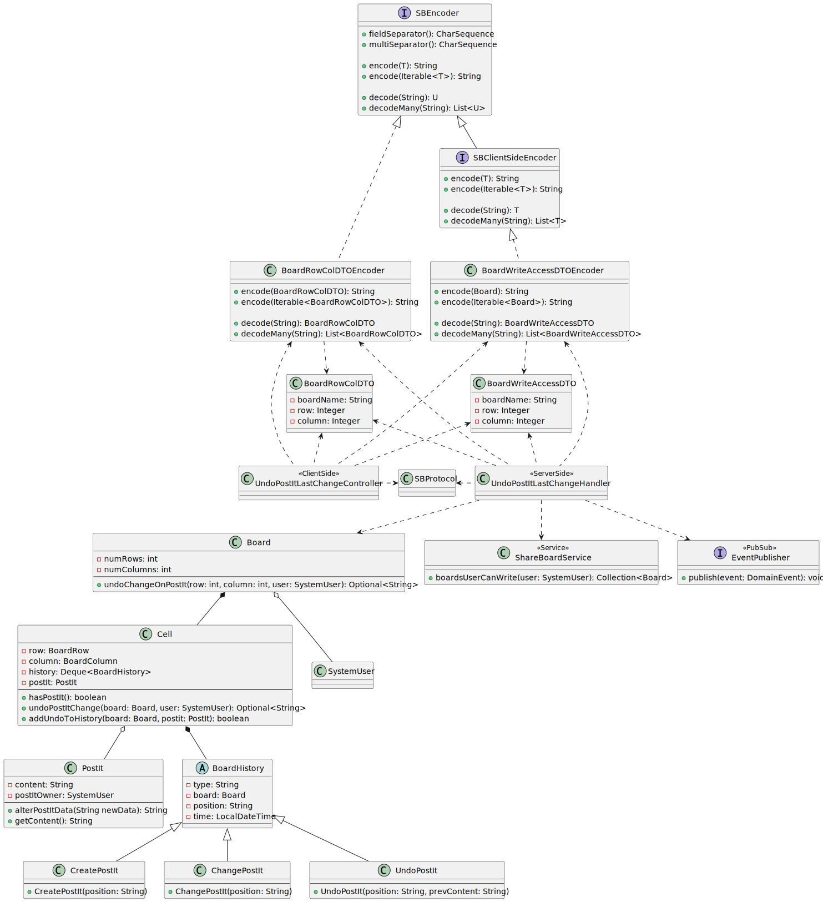
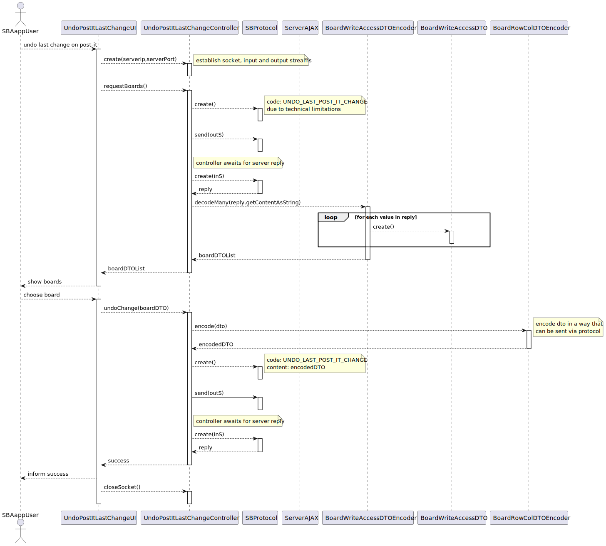
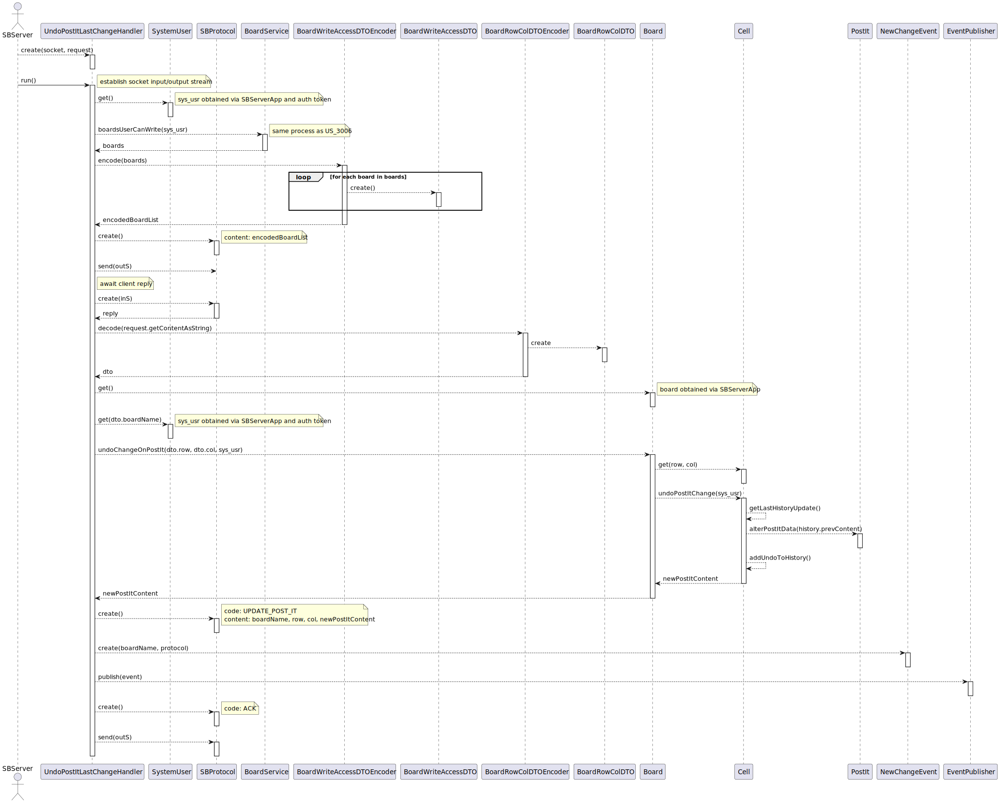

# US 3008

## 1. Context

**As User, I want to undo the last change in a post-it**

## 2. Requirements

From the project specification:

> Users with **write** permission may **post content** to a cell in the board

> When the server commits a post it also should **notify all clients with access** to the board of the **update**

> The user who **created** a post in a cell (...). The user can also **undo the last change**.

## 3. Analysis

This type of functionality can be a source of severe synchronization problems, as
several board participants could be altering/accessing the board's content at the same
type.

Even though only the owner (i.e the creator) of a post-it may change/move it, one
must consider cases where this user is logged in with multiple instances of the
client application.

Thus, the implementation of this use case must ensure data consistency when undoing the
last change on a post-it.

## 4. Design

Since the client and server applications communicate with each other by passing
"messages" via a specific protocol, the building and parsing processes of such messages
should be abstracted away from both applications, in order to reduce the apps' **coupling**
to the protocol, as its internal working could potentially be very volatile.

The **abstraction layer** must be able take a specific type of object (like a **DTO**)
the **client** can comfortably **work with** and **convert** it to some **format**
that can be sent via the **SB protocol**, and it should also be able to **decode** it
into a format the **server** can better manage.

The same should be applicable to communications in the **opposite direction**.

Synchronization problems are rather easier to manage when compared with other use cases,
as it's only a matter of ensuring the "undoing" of its last change is performed
atomically. Note that only the post-it's owner can update its content, and thus is the
only one able to undo such change.

### 4.1. Class Diagram

### 4.2 Sequence Diagram

### 4.3. Applied Patterns

- **DTO** - Data Transfer Object
- **Low coupling** - message passing mechanism is abstracted away from the server/client
- **Repository** - Provides a way to retrieve and persist aggregates.
