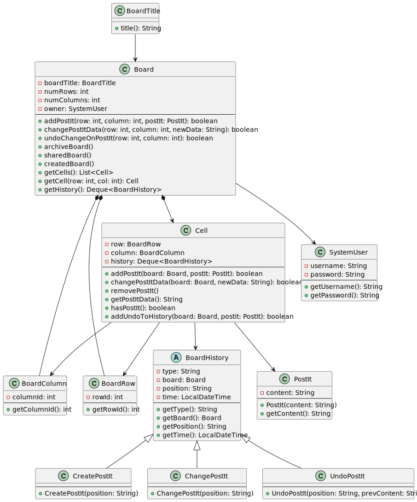
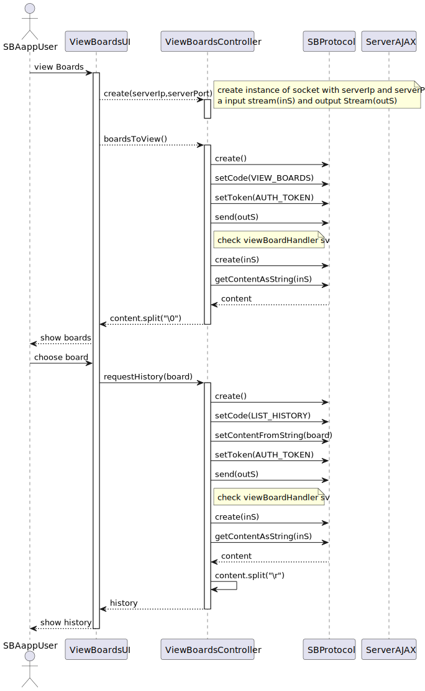
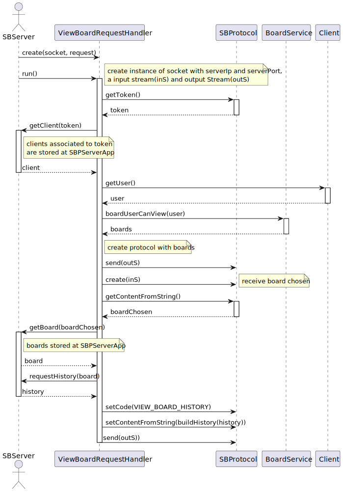

# US 3009

## 1. Context

**I want to view the History of a Board**

## 2. Requirements

*The main objective of this user story is to View the history updates of a board that a user is part of*

In order to view the history of a board first, there should be something in there.
The operations recorded in the history of a board are the following:
- US_3006 - Create a Post-it
- US_3007 - Edit/Change a Post-it
- US_3008 - Undo last Post-it Change

Every user should be able to see the updated Board History

## 3. Analysis

- Each new functionality should extend the main class board history, this class will be responsible 
for keeping one record of each operation performed in a board.
- The Board History should be presented in a chronological order, meaning the earliest operation performed in a board
should be the last one presented to the user(from the newest to the oldest).

  

## 4. Design

- To better answer this problem, we used the DTO pattern, meaning we created a class that will be responsible for
parsing the information of the board history, this class will be called **BoardHistoryDTO**.

- For easier scalability, we developed the Abstract class BoardHistory that will be extended by the following classes:
    + **CreatePostIt**
    + **ChangePostIt**
    + **UndoPostIt**

- Further classes that will be created in the future.

- The changes will be only saved on memory

### 4.1. Realization

### 4.2. Class Diagram

### 4.2.1 Sequence Diagram

### 4.3. Applied Patterns

- **DTO** - Data Transfer Object
  + **BoardHistoryDTO** - This class will be responsible for parsing the information of the board history.
- **State** - The state pattern was used to encapsulate the behavior associated with each state.
  + **BoardState**
- **Command Pattern** - BoardHistory Abstract class that will be extended by the following classes and is used to encapsulate a request as an object:
  + **CreatePostIt**
  + **ChangePostIt**
  + **UndoPostIt**
  
- **Repository** - Provides a way to retrieve and persist aggregates.
    + **BoardRepository**

### 4.4. Tests

    @Test
    public void testCreateGetType() {
    BoardHistory history = new CreatePostIt();
    String type = history.getType();

        assertEquals("CREATE", type);
    }
    @Test
    public void testUndoGetType() {
        BoardHistory history = new UndoPostIt();
        String type = history.getType();

        assertEquals("UNDO", type);
    }
    @Test
    public void testRemoveGetType() {
        BoardHistory history = new RemovePostIt();
        String type = history.getType();

        assertEquals("REMOVE", type);
    }

    @Test
    public void testUpdateGetType() {
        BoardHistory history = new ChangePostIt();
        String type = history.getType();

        assertEquals("UPDATE", type);
    }

## 5. Implementation

*In this section the team will present, important artifacts necessary to fully understand the implementation like the database operations*

 **JpaBaseRepository**
    
    public Optional<T> ofIdentity(final I id) {
        return this.matchOne("e." + this.identityFieldName() + " = :id", "id", id);
    }

    public Iterable<Board> listBoardsUserParticipatesNotArchived(SystemUser user) {
        final var query = entityManager().createQuery(
                "SELECT e.board FROM BoardParticipant e WHERE ((e.participant = :user And e.board.state <> 'ARCHIVED' " +
                "And (e.permission = 'READ' OR e.permission = 'WRITE')))",
            Board.class);
        query.setParameter("user", user);
        return query.getResultList();
    }

## 6. Integration/Demonstration

* A new option on the client App menu options was added.

## 7. Observations

Nothing to add here.