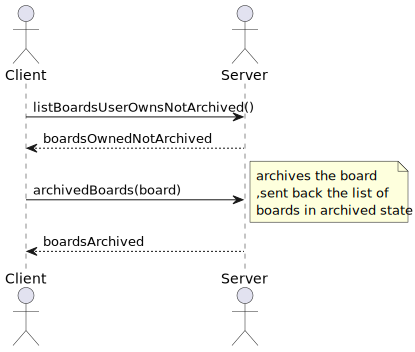
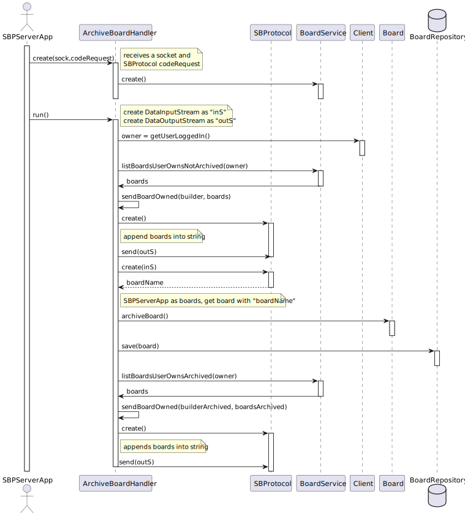

# US 3010

## 1. Context

*As User,I want to archive a board I own*

## 2. Requirements

*The main objective of this user story is to archive boards that a user owns, this user story as correlation with the following US's:*

**US 3002** As {User} I Want to create a board

- First we need a board to be created before we archive the board

**US 3005** As {User} I want to view, in real-time, the updates in the shared boards

- Although this user story it's not entirely correlated with the user story being developed , 
    the backbone of the HTTP server for the client app was developed in this user story and we need that to develop the US3010. 

## 3. Analysis

This functionality has to follow specific business rules for it to work as intended, those business rules are regarding the 
**State** of a **Board**, there are three possible properties:

- **Created** (The Board was created by the owner)
- **Shared** (The created Board was shared with other users)
- **Archived** (The Board was archived by the owner of the board)

The Board needs to be created to be possible to archive.

Only the owner of a Board can archive a Board.

When the owner of a Board wants to archive boards, the system should only display to this user
the Boards that are in two possible states **Created**  or **Shared**, it would not make sense 
for a user to be able to archive a Board already archived.

## 4. Design

To better answer this problem a service named **BoardService** will be used, the methods needed from that service is:

- `listBoardsUserOwnsNotArchived(SystemUser owner)`

This method will perform the needed database search operations in order to find the boards that
the system user owns and are in state **Created**  or **Shared**, as said before it will not make sense to the user
archive a board already archived.

After this operation the user will choose a Board to archive and after the state of the Board choosed will change
to **Archived** and the Board will be saved in **BoardRepository**.

To conclude this user story a list of the boards the user owns that are in the state **Archived** will be presented to 
user, and for this the following method will perform the needed database search operations to find the boards that
the system user owns that are in state **Archived** :

- `listBoardsUserOwnsArchived(SystemUser owner)`

### 4.1. Realization

### 4.2. Class Diagram

### 4.2.1 System Sequence Diagram(SSD)

### 4.2.2 Sequence Diagram Client

### 4.2.2 Sequence Diagram Server

### 4.3. Applied Patterns

- **Factory** - Responsible for creating complex objects or aggregates while encapsulating the creation logic.
- **Repository** - Provides a way to retrieve and persist aggregates.
    + **BoardRepository**

### 4.4. Tests

In order to accurately test this functionality, we need to interact with the Aggregate Root repositories and
with the server and client apps, meaning unit tests aren't the best approach here.

Instead, integration tests should be performed.

## 5. Implementation

*In this section the team will present, important artifacts necessary to fully understand the implementation like the database operations*

 **JpaBaseRepository**
    
    public Optional<T> ofIdentity(final I id) {
        return this.matchOne("e." + this.identityFieldName() + " = :id", "id", id);
    }

 **JpaBoardRepository**

    public Iterable<Board> listBoardsUserOwnsNotArchived(SystemUser owner)
    {
        final var query = entityManager().createQuery(
            "SELECT e FROM Board e WHERE e.owner = :owner And e.state <> 'ARCHIVED'",
            Board.class);
        query.setParameter("owner", owner);
        return query.getResultList();
    }

    
    public Iterable<Board> listBoardsUserOwnsArchived(SystemUser owner)
    {
        final var query = entityManager().createQuery(
                "SELECT e FROM Board e WHERE e.owner = :owner And e.state = 'ARCHIVED'",
                Board.class);
        query.setParameter("owner", owner);
        return query.getResultList();
    }

## 6. Integration/Demonstration

* A new option on the client App menu options was added.
* For demo purposes some tasks are bootstrapped while system starts, like boards in the three different states possible.

## 7. Observations

Nothing to add here.