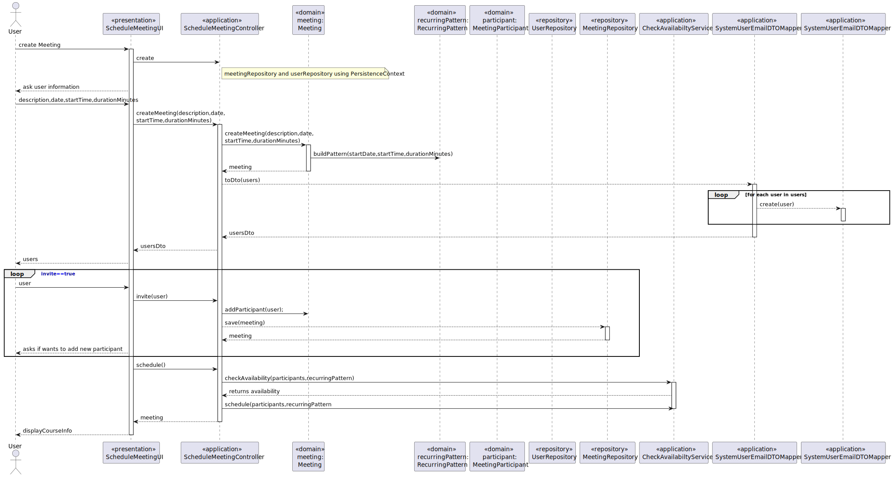

US 4001 -- Schedule a meeting
========================================================

# Analysis
## Business rules

Every user on the system must be able to schedule a meeting.
They must be able to choose users to be invited, at the time that the meeting is created the system
checks if all of the invited users are available for the given date and time of the meeting

## Unit tests

In order to accurately test this functionality, we need to interact
with the Aggregate Root repositories, meaning unit tests aren't the best approach here.

Instead, integration tests should be performed.

# Design

The event(meeting) scheduled will be mostly handle by the **TimeTableService** which will implement:

1. `checkAvailabilityByUser(SystemUser user, RecurringPattern pattern)` --- check user availability for a given pattern
2. `checkAvailabilityService(Iterable<SystemUser> users, RecurringPattern pattern)` --- check a list of user availability for a given pattern
3. `createEventService(Iterable<SystemUser> users, RecuringPattern pattern)` --- adds the given pattern to the timeTable of all users

At the time that the meeting is created it is also needed to create the corresponding meetinParticipants 

## Classes
- Domain:
    + **Meeting**
        * **Description**
    + **MeetingParticipant**
    + **MeetingParticipantStatus**
- Controller:
    + **CheckAvailabilityService**
    + **ScheduleMeetingController**
- Repository:
    + **MeetingParticipantRepository**
    + **MeetingRepository**
    + **UserRepository**
    + **TimeTableRepository**

## Sequence diagram

