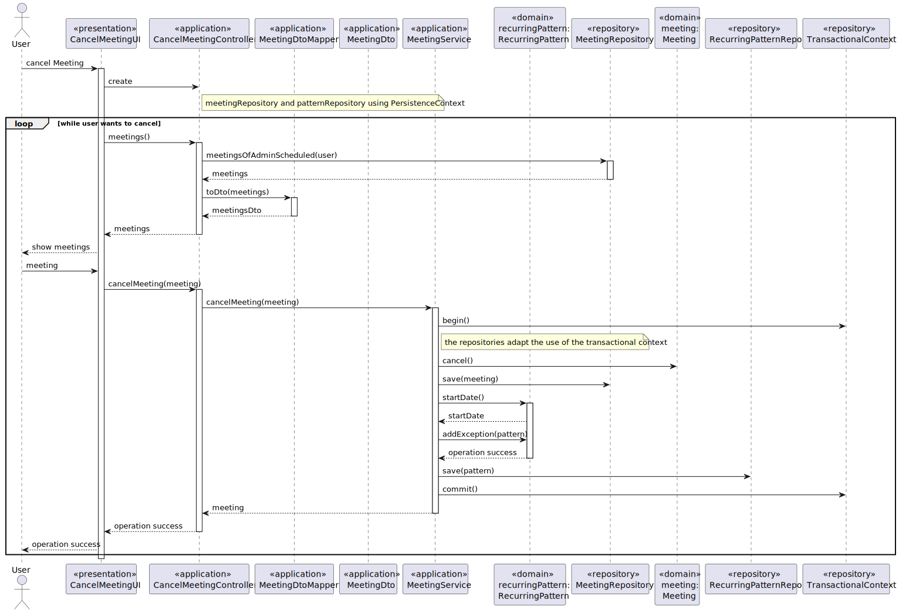

US 4002 -- Cancel a meeting
========================================================

# Analysis

## Business rules

A user must be able to cancel meetings previously scheduled by him.
After the meeting is canceled, all users that were invited must be available, so that they may have
another events scheduled for that day and time

## Unit tests

In order to accurately test this functionality, we need to interact
with the Aggregate Root repositories, meaning unit tests aren't the best approach here.

Instead, integration tests like the following should be performed:

- `ensureMeetingIsCancelled`
- `ensureParticipantsStayAvailable`

# Design

The **DTO** pattern will be applied in order to decrease the coupling that would exist otherwise with the the domain
classes.
The UI can only display meetings where the admin is the users which is logged in so

Each meeting will need to be associated with a new value which relates to the meeting state,the enum `MeetingState` that
can either be:

- SCHEDULED
- CANCELED

In this use case it is only needed to present the meetings with the state of SCHEDULED.

To avoid code duplication, the **strategy pattern** will be applied in the **MeetingRepository**,
by creating a `meetingsOfAdminWithState(systemUser,state)` that will provide a of meetings whose admin is the systemUser
and the `state` matches the one that is pretended.

## Classes

- Domain:
    + **Meeting**
    + **MeetingState**
    + **RecurringPattern**
- Controller:
    + **SystemUserService**
- Repository:
    + **MeetingRepository**
    + **UserRepository**
    + **PatternRepository**

## Sequence diagram

