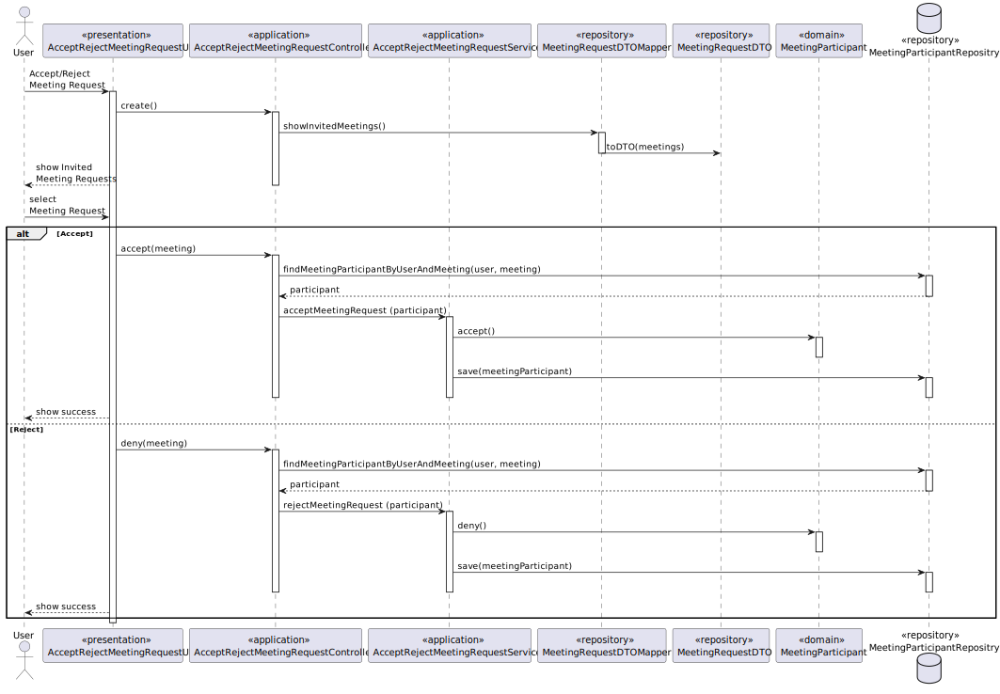
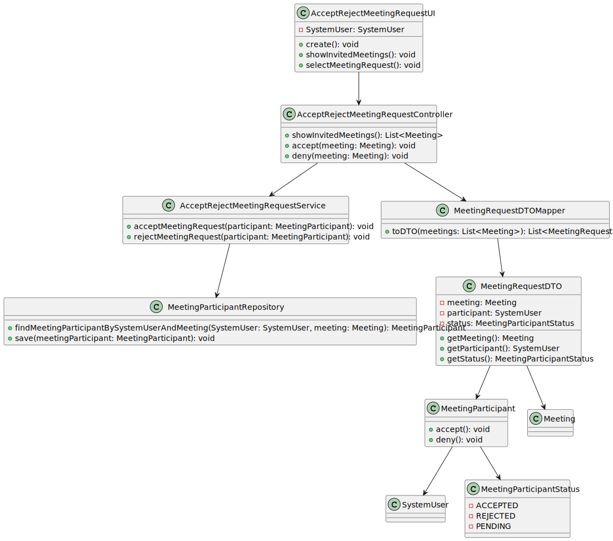

# US 4003 -- Accept/Reject Meeting Request

## 1. Analysis

A request is generated when a user wants to schedule a meeting with another user.
The user must have a menu to accept or reject the request.

## 2. Requirements

This use case is based on the following requirements:

- **R1.** Every user on the system must be able to accept and refuse a meeting request.
- **R2.** The user that creates the meeting is already considered to be accepted.

### 2.1. Questions, Answers and Interpretations

nothing to add here, no questions were asked.

## 3. Design

This use case is very similar to [US 2004](../us_2004/README.md), meaning much of
what was described in that US's analysis/design applies to this US as well.

Some of the major implementation differences:

- formative exams are generated based on questions from the questions' repository
- formative exams have **do not** have **start** or **end dates**.
- feedback/grades are **only** provided **at the end** of the exam

### 3.1. Realization

#### Sequence Diagram

](./AcceptRejectMeetingRequestSD.svg)

### 3.2. Classes

](./cd.svg)

### 3.3. Applied Patterns

- **DTO** - Data Transfer Object
    + **MeetingRequestDTO** - This class will be responsible for parsing the information.
- **State** - The state pattern was used to encapsulate the behavior associated with each state.
    + **MeetingParticipantStatus**
- **Repository** - Provides a way to retrieve and persist aggregates.
    + **MeetingParticipantRepository**

### 3.4. Tests

In order to accurately test this functionality, we need to interact
with the Aggregate Root repositories, meaning **unit tests aren't the best approach here**.

Instead, integration tests should be performed.

## 4. Integration/Demonstration

nothing to add here

## 5. Observations

This use case was successfully implemented, and **all the requirements were met**.

This functionality did not require an extensive discussion with the client, as it was