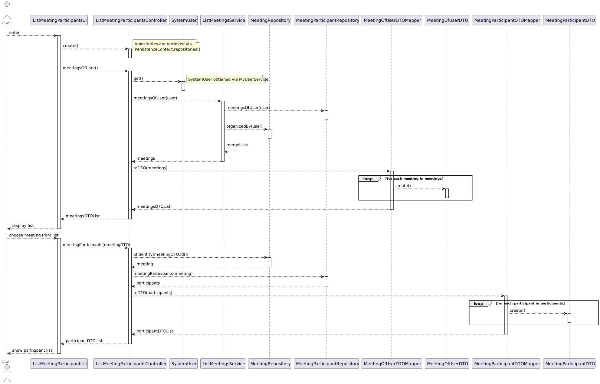

# US 1001 --- As User, I want to view a list of participants in my meeting and their status

## 1. Requirements / Analysis

Any user can view the participants of a meeting provided they're a participant themselves
or they're the organizer.

The time at which the meeting occurred is not relevant; meaning the user should be able
to view the list of participants of meeting from the past/future or ongoing meetings.

**Note**: This information was extracted from [this forum thread](https://moodle.isep.ipp.pt/mod/forum/discuss.php?d=23327#p29513).

## 2. Design

### User interface and use case controller
This functionality is **exactly** the same regardless of user role
(teachers, managers and students can all participate in meetings), which means
a single use case controller is required and the user interface should be implemented
in the `base.app.common.console` module and then added to the menu of each user role.

### Implementation constraints

Before being able to view the list of participants, the user must select a meeting
from those that they are a part of; meaning a `meetingsOfUser` method should be
implemented in the **MeetingParticipantRepository**.

However, due to our approach to the Meeting and MeetingParticipant classes,
such method isn't enough, as the organizer/owner of a meeting is not persisted
as a "Meeting participant".

This then leads us to also implement a `organizedBy` method in the **MeetingRepository**,
as the owner is an attribute of Meeting.

The two lists return by the above methods would need to be merged together before
they're returned to the UI; however, as accessing two different repositories and merging
the lists by them returned isn't a task for a Use Case controller, a separate service should
be created for the task. Hence the existence of the **ListMeetingsService**.

The implementation of MeetingParticipant could also cause some issues when listing
the participants of the select meeting; however, the Meeting object the UI
interacts with (meeting chosen from a list) holds information regarding the
organizer, so the UI can display information about this user with no problem.

### 2.1. Realization

The [following sequence diagram](./sd.svg) was developed to answer this use case:

### 2.2. Class Diagram

](./cd.svg)

### 2.3. Applied Patterns

Once again, **DTO** objects will be used so as to decouple the UI from the domain
classes.
### 2.4. Tests

None. This feature requires integration tests, which are out of scope for this POC.

## 3. Integration/Demonstration

1. Log in as any user
2. Create a new meeting
3. Invite some users
4. Select the "view meeting participants" option
5. Observe the participant list
