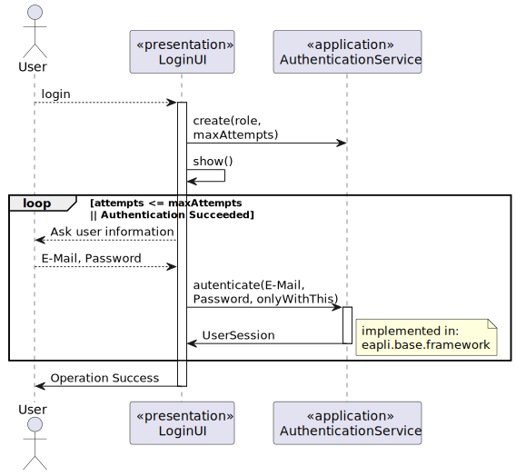
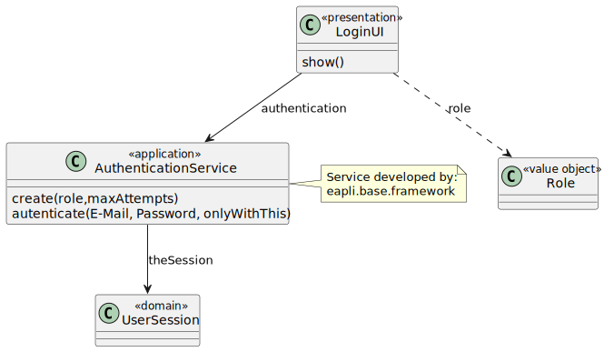

## User Story

**Login**

The system must support and apply authentication and authorization for all its users and funcionalities.

## Analysis

- The client mentioned that the solution for this issue would be at the developer's criteria,
  either one application or three for each user, would be equally accepted.

## Business Rules

- A User must only login onto an application with the correspondent role.
- Can only be assigned **one** role by User.

## Design

Was taken into consideration for the development of this feature, the base EAPLI project with
all the presented functionalities.

The following represents the sequence diagram for this specific US:

The following represents the class diagram for this specific US:

## Test Planning

## Development and Testing

## Integration

## TODO
